## 3. Data and Cleaning

### 3.1 Jobs Data Cleaning

#### 3.1.1 Notebook Workflow

Methodologically, the notebook follows a standard data engineering pattern:

1. Ingest raw semi-structured JSON records.
2. Standardise nested fields into tabular columns.
3. Filter for the target population of interest.
4. Engineer interpretable features.
5. Clean and regularise skills.
6. Persist analysis-ready outputs.
7. Run descriptive analyses to validate whether the cleaned dataset reflects plausible labour-market patterns.

This sequence separates structural cleaning from analytical interpretation while keeping both in the same artifact for transparency.

#### 3.1.2 Project-Wide Pipeline Overview

- Add a short end-to-end overview of the full project workflow:
  - raw job and module data acquisition
  - scraper outputs
  - notebook-based cleaning
  - downstream dataset construction
  - canonical skill mapping
  - module-job alignment
- Clarify that the report should ultimately cover the full project system, not only the jobs notebook.
- State that the notebook-cleaned PKL files are now the source of truth for downstream workflows.
- Mention the standardized shell-script entrypoints for the supported pipelines.

#### 3.1.3 Data Collection and Ingestion

The loader searches `../../data` recursively for files whose names begin with `MCF-`, falling back to a `job` subdirectory only if needed. This is a robust engineering decision because it prioritises the intended project data while remaining resilient to folder reorganisation. During execution, the notebook discovered **22,718 raw JSON files** and loaded **22,718 job rows**.

Each record is flattened into a structured row with fields such as:

- `uuid`
- `title`
- `description`
- `minimum_years_experience`
- `skills`
- `employment_types`
- `position_levels`
- `categories`
- `salary_minimum`, `salary_maximum`
- posting and expiry dates
- `ssoc_code` and `ssoc_version`

The notebook also strips HTML from descriptions using `BeautifulSoup`, which is important because job descriptions are often stored as HTML fragments rather than plain text. This reduces noise before text-based filtering and makes length checks more meaningful.

#### 3.1.4 Targeted Cleaning for Graduate-Relevant Roles

The first major cleaning stage aligns the dataset to the project objective: identifying labour demand relevant to undergraduates and recent graduates.

The pipeline applies the following filters:

- Keep only postings with `minimum_years_experience` in `{0, 1}`.
- Drop rows missing title or description.
- Remove descriptions with fewer than 10 words.
- Remove internships using title, description, and employment-type signals.
- Remove likely postgraduate roles using title cues such as "research fellow" or "assistant professor".
- Remove postings whose descriptions strongly indicate postgraduate qualifications, including PhD or Master's requirements.
- Deduplicate records using the pair `(title, description)`.

The observed row counts show the effect of each stage:

| Stage | Rows Remaining |
|---|---:|
| Raw loaded postings | 22,718 |
| After experience filter | 9,477 |
| After description filter | 9,476 |
| After undergraduate-only filter | 8,834 |
| After deduplication | 7,115 |
| After skill thresholding | 7,104 |

These filters demonstrate robustness in two ways. First, they address known data quality issues such as sparsity and duplication. Second, they encode domain logic rather than relying on generic preprocessing. In a public-sector context, that matters because the distinction between internship, graduate, and postgraduate pipelines is policy-relevant: interventions for undergraduate curriculum design should not be distorted by jobs intended for researchers or late-stage professionals.

#### 3.1.5 Employment Type, Salary, and Imputation Logic

The notebook derives `contract_type` and `work_type` from employer-provided `employment_types`, mapping values into interpretable categories such as `Permanent`, `Contract`, `Temporary`, `Freelance`, `Full Time`, and `Part Time`.

If both contract type and work type are unknown, the row is removed. This avoids carrying forward records with insufficient labour-market signal.

The notebook then converts salary fields to numeric format and computes `avg_salary` as the rounded mean of minimum and maximum salary. For work type, the notebook implements a two-step imputation strategy:

- First, infer likely work type using the modal observed work type within the same 3-digit SSOC group.
- If SSOC-based inference is unavailable, fall back to a salary threshold derived from the median salaries of known full-time and part-time jobs.

It compromises between practical utility and interpretability. It is more principled than filling all missing work types with the dominant class, because it uses occupational structure first and only uses salary as a weaker fallback. In public-sector analytics, such hierarchy-based imputation is preferable because it better preserves real labour-market structure.

After cleaning, the final job dataset contains:

- **7,104 rows**
- **6,448 full-time postings**
- **656 part-time postings**
- Contract types dominated by `Unknown` (3,133) and `Permanent` (2,781), followed by `Contract` (804), `Temporary` (331), and `Freelance` (55)

The large `Unknown` contract-type share is itself an important analytical finding: it reflects incomplete source metadata and should be acknowledged in any downstream interpretation.

#### 3.1.6 Skill Normalisation and Frequency Filtering

The skill cleaning process has several stages:

1. Lowercase and trim raw skills.
2. Save raw skill frequencies to Excel for auditability.
3. Normalise punctuation and spacing.
4. Remove explicitly low-value labels such as `team player`, `able to work independently`, and `physically fit`.
5. Collapse variants of common soft skills into shared canonical forms, such as mapping phrases containing "communication" to `communication`.
6. Protect selected exact multi-word skills such as `project management` and `data management` from over-collapsing.
7. Remove within-row near-duplicates using fuzzy matching (`SequenceMatcher`).
8. Keep only skills that appear at least three times across the dataset.
9. Remove jobs with fewer than three cleaned skills.

This design balances precision and recall. If the notebook kept every raw employer phrase, the analysis would be overwhelmed by lexical variation and boilerplate. If it over-normalised aggressively, it would erase meaningful distinctions between technical competencies. The use of exact-keep exceptions and fuzzy deduplication shows good practical understanding of this trade-off.

The final distribution of skill counts is plausible for job postings:

- Mean number of skills per posting: **12.76**
- Median: **13**
- Interquartile range: **10 to 15**
- Minimum retained: **3**
- Maximum retained: **20**

The notebook also exports raw and cleaned skill-frequency tables to Excel, which is valuable for stakeholder review. Non-technical reviewers can inspect the vocabulary and challenge cleaning rules if necessary, making the process more governable.

#### 3.1.7 Evaluating Goodness of Job 
**to be added back after section is restored in notebook!!!**

#### 3.1.8 Output Structure and Reusability

The cleaned dataset is saved as `data/cleaned_data/jobs_cleaned.pkl`. Before saving, the notebook drops intermediate helper columns and reorders the final schema so downstream consumers receive a compact, consistent table.

This is good execution practice. Instead of passing along every temporary artifact created during cleaning, the notebook separates internal processing columns from production-facing outputs. That makes later analysis cleaner and reduces accidental dependency on unstable intermediate fields.

#### 3.1.9 Descriptive Validation and Exploratory Analysis

The second half of the notebook performs descriptive analysis on the cleaned data. This is not merely exploratory; it acts as a validation layer. If the top titles, skill distributions, and data-role patterns were obviously implausible, that would signal a problem in the cleaning pipeline.

Examples from the cleaned dataset include:

- Most common entry-level titles: `warehouse assistant` (31), `admin assistant` (24), `administrative assistant` (20), `sales executive` (19), `accounts assistant` (19)
- Most common skills overall: `Team Player` (2,857), `Customer Service` (2,114), `Interpersonal Skills` (2,059), `Communication Skills` (1,718), `Microsoft Office` (1,677)
- Titles with the widest skill range include `business development executive` (110 unique skills) and `marketing executive` (99 unique skills)

The notebook also isolates a subset of data-related roles using keyword matching. This subset contains **29 postings**, with top skills including `SQL` (14), `Data Analysis` (12), `Python` (12), `Business Analysis` (10), and `Business Requirements` (10). Median salary in this subset is **5,000**, with most postings marked as full-time.

These summaries directly support the broader project objective. They show what employers actually ask for and create a bridge to course-side skill extraction. For a university or public-sector workforce unit, this is the dataset that can later be matched against curriculum content to identify alignment gaps.

### 3.2 University Data Cleaning

#### 3.2.1 University Course Cleaning Methodology
The notebook follows a structured data engineering workflow to transform raw, semi-structured course data into an analysis-ready dataset. It begins by ingesting module data from multiple universities and standardising heterogeneous schemas into a unified tabular format. Textual fields such as titles, descriptions, and departments are cleaned and normalised, after which the dataset is filtered to retain undergraduate-relevant modules. Noisy or low-quality records are removed, and the cleaned text is prepared for downstream NLP tasks such as skill extraction. The final dataset is persisted as a structured output, with validation checks performed to ensure plausibility. This workflow separates data preparation from analysis while maintaining transparency within a single notebook.

#### 3.2.2 Project-Wide Pipeline Overview
At a system level, this notebook forms part of a broader end-to-end pipeline. The process spans raw module data acquisition (from NUS, NTU, and SUTD), preprocessing and scraping, notebook-based cleaning, and construction of a unified dataset. This dataset feeds into skill extraction and canonical skill mapping, which are then aligned with job-side skill demand for downstream analytics such as curriculum–labour market comparison. The cleaned dataset serves as the source of truth for all subsequent workflows, ensuring consistency across the project.

#### 3.2.3 Data Collection and Ingestion
Module data is loaded from multiple sources and consolidated into a unified structure despite differences in schemas and formatting. NUS data is obtained via API, while NTU and SUTD data are sourced from scraper outputs, with NTU department codes mapped to full names using an external lookup table. Key fields—module code, title, description, and department—are extracted and standardised, and a university column is added to preserve provenance.

#### 3.2.4 Text Cleaning and Normalisation
Given the inconsistency of module descriptions, extensive text cleaning is applied. This includes lowercasing, spelling standardisation, HTML removal using BeautifulSoup, elimination of invalid Unicode characters, and whitespace normalisation. These steps ensure that textual data reflects meaningful content rather than formatting artefacts, which is critical for downstream NLP tasks.

#### 3.2.5 Targeted Filtering for Undergraduate Modules
To align with project objectives, the dataset is filtered to retain only undergraduate-relevant modules. Modules with very short descriptions are removed, along with those from irrelevant faculties and postgraduate programmes identified through title and description cues. Rows with missing essential fields are also excluded. This ensures that the dataset reflects curriculum content relevant to entry-level job demand.

#### 3.2.6 Preparation for Skill Extraction
The cleaned dataset is further processed for NLP-based skill extraction. Descriptions are tokenised into manageable units, word counts are computed robustly, and text is normalised to reduce variation. This preprocessing ensures compatibility with embedding-based models such as MiniLM, preserving semantic signals while minimising noise.

#### 3.2.7 Schema Standardisation Across Universities
Finally, the notebook harmonises data across universities by standardising column names, department representations, and text formats. The dataset adopts a consistent schema (code, title, department, description, university, and skill-related fields) and is saved as a .pkl file. Intermediate artifacts are removed, producing a compact, stable dataset suitable for downstream analysis.

After cleaning, the final university dataset contains:

- **'NUS': 8499 rows of modules**
- **'NTU': 1817 rows of modules**
- **'SUTD': 199 rows of module**

## 4. General Pipeline

### 4.1 Downstream Baseline Pipeline

The main workflow lives in `src/create_test/` and starts from `data/cleaned_data/combined_courses_cleaned.pkl` and `data/cleaned_data/jobs_cleaned.pkl`, which are the source of truth for downstream analysis. It converts cleaned modules and jobs into comparable skill profiles, maps them into a shared canonical vocabulary, and computes module-job alignment. The full workflow runs via `bash src/create_test/run_baseline_pipeline.sh`.

```mermaid
flowchart LR
    A["combined_courses_cleaned.pkl"] --> C["create_test_datasets.py"]
    B["jobs_cleaned.pkl"] --> C["create_test_datasets.py"]
    C --> D["module_descriptions_test.jsonl"]
    C --> E["job_descriptions_test.jsonl"]
    F["module_skill_rules.py"] --> G["build_canonical_skill_framework.py"]
    G --> H["canonical_skill_framework_v4.json"]
    E --> I["extract_job_ssoc3_from_original.py"]
    I --> J["job_ssoc345_with_skills_from_original.jsonl"]
    D --> K["canonical_skill_mapper.py"]
    J --> K["canonical_skill_mapper.py"]
    H --> K
    K --> L["module_skills_canonical.jsonl"]
    K --> M["job_skills_canonical.jsonl"]
    L --> N["align_module_job_canonical.py"]
    M --> N
    N --> O["module_job_alignment_canonical.json"]

    classDef script fill:#dceeff,stroke:#24557a,stroke-width:1.5px,color:#102a43;
    classDef data fill:#e8f5e9,stroke:#2f6b3a,stroke-width:1.5px,color:#183a1d;

    class C,G,I,K,N,F script;
    class A,B,D,E,H,J,L,M,O data;
```

#### 4.1.1 Pipeline Inputs and Export Layer

`create_test_datasets.py` exports downstream JSON/JSONL files from the PKLs. It uses `university::code` as module identity and `uuid` as job identity, applies a final description-length filter, and preserves module skills, department metadata, SSOC fields, salary, cleaned job skills, and the binary field `is_good_job`. In full mode it produced **10,507 module rows** and **7,104 job rows**.

#### 4.1.2 Canonical Skill Framework Construction

`build_canonical_skill_framework.py` builds the shared vocabulary used on both sides. `data/reference/canonical_skill_framework_v4.json` stores canonical labels, skill types, aliases, notes, and excluded phrases. The current framework contains **89 canonical skills** and **24 excluded phrases**. This step is necessary because direct phrase overlap is too brittle for module and job text.

#### 4.1.3 Role of `module_skill_rules.py`

`module_skill_rules.py` defines the module-side skill vocabulary. It was built by reviewing recurring module-description phrases, merging lexical variants under canonical skills, and filtering phrases that were too broad, academic, or pedagogical to function as occupational skills. The file contains phrase-to-skill rules, allowed canonical labels, evidence constraints, and blocklists. The baseline pipeline uses these rules to build the framework; the experimental and STEM pipelines reuse them during module-skill extraction.

#### 4.1.4 Job-Side SSOC Enrichment

`extract_job_ssoc3_from_original.py` converts cleaned jobs into SSOC-indexed labour-demand rows. It parses each raw SSOC field into 5-digit, 4-digit, and 3-digit codes, looks up titles from `ssoc2020.xlsx`, and writes flattened rows with SSOC hierarchy and deduplicated job skills. It also propagates `is_good_job` and computes a group-level job-quality statistic for each 3-digit SSOC bucket:

`good_job_pct = (number of jobs with is_good_job = 1 in SSOC group) / (total jobs in SSOC group)`

`good_job_pct` is stored on a `0` to `1` scale. On the full baseline run, all **7,104** job rows were preserved.

#### 4.1.5 Canonical Mapping

`canonical_skill_mapper.py` maps raw phrases into the shared framework for both modules and jobs. Each phrase is normalized, checked against excluded phrases, matched exactly against aliases where possible, and otherwise mapped semantically with `sentence-transformers/all-MiniLM-L6-v2`. The semantic fallback uses a cosine-similarity threshold of **0.72**; phrases below the threshold remain unmapped. The mapper writes row-level canonical skill lists and phrase-level mapping details. On the full baseline run, **10,507** module rows and **7,104** job rows were canonicalized.

#### 4.1.6 Alignment Logic

`align_module_job_canonical.py` compares each module against grouped job demand in canonical skill space. Jobs are grouped at the **3-digit SSOC level**, giving **119 job groups**. Each SSOC group is represented by a weighted canonical skill profile. Each module is then scored against every profile using top-`k` coverage, weighted Jaccard overlap, cosine similarity, and a gap score for missing high-weight job skills. These are combined into:

`alignment_score = 0.4 * coverage + 0.25 * weighted_jaccard + 0.2 * cosine_similarity + 0.15 * (1 - gap_score)`

The weights assigned to each metric are intentionally heuristic, prioritising coverage of an SSOC group’s **core skills**, incorporating broader similarity, and penalising missing important skills. We prioritise whether a module teaches the job group’s most demanded skills, and refine that signal with broader similarity measures.

We then add a job-quality layer. Each matched SSOC group carries `good_job_pct`, and each module-to-group match receives:

`quality_weighted_alignment_score = alignment_score * good_job_pct`

To reduce dependence on a single match, we also compute:

`top3_weighted_good_job_pct = sum(alignment_score_i * good_job_pct_i) / sum(alignment_score_i)` for the top three matches.

The denominator converts the weighted sum into a weighted average, so the result stays on the same `0` to `1` scale as `good_job_pct`. The script also aggregates module-level results by department.

On the full baseline rerun, the results were `module_count = 10,507`, `empty_modules = 136`, `job_group_count = 119`, `top1_overlap_rate = 0.7391`, `average_top1_score = 0.0647`, `average_top1_good_job_pct = 0.6466`, `average_top1_quality_weighted_alignment = 0.0385`, and `average_top3_weighted_good_job_pct = 0.3564`. These additions distinguish alignment to job demand in general from alignment to demand concentrated in better-quality entry-level roles.

Dataset-level metrics are defined as follows. `module_count` is the number of evaluated modules. `empty_modules` is the number of modules with an empty canonical skill list. `job_group_count` is the number of SSOC groups with at least one canonical job-skill profile. `top1_positive_modules` counts modules whose top-ranked SSOC match has `alignment_score > 0`, so `top1_positive_rate = top1_positive_modules / module_count`. `top1_overlap_modules` counts modules whose top-ranked SSOC match has `strict_overlap_count > 0`, so `top1_overlap_rate = top1_overlap_modules / module_count`. `average_top1_score` is:

`average_top1_score = sum(top1_alignment_score_m) / N`

where `N` is the number of modules with at least one top match. The job-quality summaries are:

`average_top1_good_job_pct = sum(top1_good_job_pct_m) / N`

`average_top1_quality_weighted_alignment = sum(top1_quality_weighted_alignment_score_m) / N`

`average_top3_weighted_good_job_pct = sum(top3_weighted_good_job_pct_m) / N`

Department-level results average the same module-level quantities within each `(source, department)` bucket. For department `d`:

`department_average_top1_score_d = sum(top1_alignment_score_m for m in d) / M_d^*`

where `M_d^*` is the number of modules in `d` with at least one top match. The same form is used for department-level `average_top1_good_job_pct`, `average_top1_quality_weighted_alignment`, and `average_top3_weighted_good_job_pct`.

### 4.2 Experimental Comparison

The experimental workflow lives in `src/create_test/experimental/` and runs via `bash src/create_test/run_experimental_pipeline.sh`. It changes one component only: module-side skill extraction. The baseline uses notebook-derived module skills; the experimental path replaces them with `experimental/extract_module_skills_independent.py`. The job-side pipeline, SSOC enrichment, canonical framework, and alignment logic remain fixed.

#### 4.2.2 Independent Module Skill Extraction

The independent extractor reads the same module descriptions but derives skills directly from text. It generates candidate phrases with an n-gram vectorizer, embeds descriptions and candidate phrases with `all-MiniLM-L6-v2`, ranks candidates by semantic relevance, applies rule-based matches from `module_skill_rules.py`, filters broad academic phrases, and normalizes the survivors into the same canonical skill space. We tested it because some baseline outputs were too generic. For example, `Search Engine Optimization and Analytics` looked marketing-heavy under the baseline but yielded `search engine optimization`, `Data Analysis`, `Machine Learning`, `Optimization`, and `Algorithm Design` under the independent extractor, while `Biology Laboratory` produced more domain-faithful laboratory skills.

#### 4.2.3 Experimental Results and Failure Mode

Although the independent extractor improved some technical examples, it performed much worse at dataset level. On the same **10,507** modules, the baseline left **136** empty modules while the experimental pipeline left **2,819**. The baseline achieved **0.7391** top-1 overlap and **0.0647** average top-1 score, compared with **0.5775** and **0.0410** for the experimental pipeline. Because the experimental path reuses the same SSOC enrichment, canonical framework, and job-quality-aware alignment logic, this remains a controlled comparison. The key failure occurs upstream of canonical mapping: rows that are empty in `module_skills_canonical_independent.jsonl` are already empty in `module_descriptions_test_with_skills_independent.jsonl`.

Table 1 summarizes the baseline-versus-experimental comparison on the full dataset.

| Metric | Baseline | Experimental | STEM Pipeline |
|---|---:|---:|---:|
| Modules evaluated | 10,507 | 10,507 | 4,431 |
| Empty modules | 136 | 2,819 | 19 |
| Non-empty modules | 10,371 | 7,688 | 4,412 |
| Job group count | 119 | 119 | 119 |
| Top-1 overlap modules | 7766 | 6068 | 4411 |
| Top-1 overlap rate | 0.7391 | 0.5775 | 0.9955 |
| Average top-1 score | 0.0647 | 0.0410 | 0.1562 |
| Average top-1 good job pct | 0.6466 | 0.6824 | 0.5338 |
| Avg canonical skills per non-empty module | 4.537 | 2.419 | 7.356 |
| Average top-1 quality weighted alignment | 0.0385 | 0.0235 | 0.086 |
| Average top-3 weighted good job pct | 0.3564 | 0.2843 | 0.4829 |

Here, `non-empty modules = module_count - empty_modules`. `Top-1 overlap rate = top1_overlap_modules / module_count`, where `top1_overlap_modules` counts modules whose best-matching job group contains at least one overlapping canonical skill. `Average top-1 score = sum(top1_alignment_score_m) / N`, where `N` is the number of modules with at least one top match. `Avg canonical skills per non-empty module = (sum of canonical skill counts across non-empty modules) / (number of non-empty modules)`. The table shows that the baseline preserves more module-side signal, produces overlap for more modules, and yields stronger best-match alignments.

Table 2 shows representative module-level examples. These examples explain both why the independent extractor was worth testing and why it was not retained as the final model.

| Module | Baseline canonical skills | Experimental canonical skills | Interpretation |
|---|---|---|---|
| `Search Engine Optimization and Analytics` | `Marketing`, `Programming`, `Python`, `research skills` | `Algorithm Design`, `Data Analysis`, `Machine Learning`, `Optimization`, `Programming`, `Python`, `search engine optimization` | experimental is more technically specific |
| `Biology Laboratory` | `ecological design`, `genetic engineering`, `research skills` | `Laboratory Skills`, `Research`, `life science research`, `research lab` | experimental is more domain-faithful |
| `From DNA to Gene Therapy` | `Project Management`, `fieldwork`, `genetic engineering`, `research skills` | empty | experimental is too brittle at scale |

#### 4.2.4 Final Decision from the Comparison

We therefore kept the baseline pipeline as the main general workflow. The independent extractor could be more accurate on some technical modules, but its coverage loss was too large for full-dataset reporting. It was more specific when it worked, but too brittle for the main analysis. This result motivated the STEM robustness check.

## 5. STEM Robustness Analysis

We introduced a STEM-focused test to reduce cross-domain noise in module-job matching. In the full module universe, many modules are intentionally non-technical or mixed-context, which can dilute technical-skill signals and make alignment scores harder to interpret for workforce-oriented technical roles. By scoping to STEM, we test whether alignment patterns remain consistent under a more technically coherent module set, and to check for robustness and sensitivity.

### 5.1 STEM Classification and Pipeline

We classify modules into STEM and non-STEM using a hybrid method that combines university-specific metadata classification with semantic text understanding at the paragraph, sentence and keyword levels. Firstly, we mapped modules offered by each university’s STEM-focused departments/faculties as STEM.

For all other modules, we ran an **embedding-based paragraph classifier**, considering the semantic meaning of the module title and description. We used `sentence-transformers` to compare module embeddings with manually constructed STEM and non-STEM prototype centroid texts. The model calculated `stem_similarity`, `non_stem_similarity`, and `margin = stem_similarity - non_stem_similarity`. If `margin` is strongly negative (`<= -2%`, suggesting non-STEM dominates), we block the STEM override. For strongly positive margin (`>= 6%`, suggesting STEM dominates), we classify as a STEM module. This prevents isolated STEM keywords influencing clearly non-STEM contexts. For example, NUS EN4229 Autotheory and Contemporary Autofiction is a non-STEM module, but has the word "regression" in the sentence "Does it signal a **regression** to the Self/Subject as already critiqued by theory in the 1980s?". Hence, we need to consider the description's meaning for a robust classification.

For non-decisive paragraph semantics (`-2% < margin < 6%`), we evaluate **sentence-level semantic scoring** as a tie-breaker. We compare each sentence’s STEM vs non-STEM similarity margin and count supporting versus opposing sentences using a fixed margin threshold (`±0.04`). We then apply a STEM override only if the overall document margin is non-negative and supporting evidence exceeds opposing evidence by at least one sentence (`support_count - oppose_count >= 1`).

If semantic overrides still do not trigger, we apply a final keyword fallback (`quant_min_score = 2`) with contextual safeguards (false positives, quantitative-term blocklists, non-STEM context checks).

Apart from the STEM-specific scoping and module extraction, the `stem_test` pipeline keeps the same downstream alignment backbone as `create_test` **[include a hyperlink!!!!]** (shared canonical framework, canonical mapper, and SSOC-based alignment).

```mermaid
flowchart LR
    A["combined_courses_cleaned.pkl"] --> S1["stem_1_generate_scope_classifications.py"]
    S1 --> S2["stem_1_scope_classifier.py"]
    S2 --> S3["stem_1_generate_sankey.py"]
    S3 --> S4["stem_2_create_test_datasets.py"]

    B["jobs_cleaned.pkl"] --> S4
    S4 --> D["module_descriptions_test_STEM.json"]
    S4 --> E["job_descriptions_test_STEM.json"]

    F["module_skill_rules.py"] --> G["stem_5_build_canonical_skill_framework.py"]
    G --> H["canonical_skill_framework_v4.json"]

    D --> X["stem_3_extract_module_skills_independent.py"]
    X --> Y["module_descriptions_test_with_skills_independent_STEM.jsonl"]

    E --> I["stem_4_extract_job_ssoc3_from_original.py"]
    I --> J["job_ssoc345_with_skills_from_original_STEM.jsonl"]

    Y --> K["stem_6_canonical_skill_mapper.py --map-stem-pipeline"]
    J --> K
    H --> K
    K --> L["module_skills_canonical_stem.jsonl"]
    K --> M["job_skills_canonical_stem.jsonl"]

    L --> N["stem_8_align_module_job_canonical.py"]
    M --> N
    N --> O["module_job_alignment_STEM.json"]

    classDef script fill:#dceeff,stroke:#24557a,stroke-width:1.5px,color:#102a43;
    classDef data fill:#e8f5e9,stroke:#2f6b3a,stroke-width:1.5px,color:#183a1d;

    class S1,S2,S3,S4,G,X,I,K,N,F script;
    class A,B,D,E,H,Y,J,L,M,O data;

```

### 5.2 Results

On the STEM subset (**4,431 modules**), the STEM pipeline yields **very high coverage** and **stronger top-1 alignment metrics**. This should be interpreted as an **in-domain robustness result** rather than a direct improvement claim over full-module pipelines.

**Table 3** summarises the results for the STEM dataset, relative to the experimental pipeline.

| Metric | Experimental | STEM Pipeline |
|---|---:|---:|
| Modules evaluated | 10,507 | 4,431 |
| Empty modules | 2,819 | 19 |
| Non-empty modules | 7,688 | 4,412 |
| Top-1 overlap rate | 0.5775 | 0.9998 |
| Average top-1 score | 0.0410 | 0.1571 |
| Avg canonical skills per non-empty module | 2.419 | 7.356 |

Note: Experimental metrics are described in Section 3.2.3;. Differences reflect model/pipeline effects and dataset scope/composition effects.

The observed improvements likely come from **improved fit of STEM-specific extraction/mapping rules** and a **semantically more homogeneous module set**. STEM modules are generally more skill-dense and use technical terminology that maps more directly to canonical skills and job taxonomies. Therefore, STEM-specific constraints demonstrates robustness.

## 6. Results

### 6.1 Discussion

Our pipelines provide a usable signal of **module-level labour-market relevance**. This signal is most useful in relative terms: comparing modules, departments, and pipelines by coverage, empty-module rates, and match plausibility. It is less meaningful to interpret any one alignment score in isolation.

One key interpretation is that **absolute top-1 scores are numerically low** on average. A single module typically contains only a subset of skills needed for a job, while jobs require bundles of competencies accumulated across multiple modules and learning experiences. The practical question is whether the system can consistently rank modules, reduce empty outputs, and return substantively plausible top matches. On these criteria, the pipeline is informative for prioritisation and review.

This also clarifies that module-level alignment does not imply programme-level readiness. One module rarely prepares a student for a job by itself. The outputs should therefore be interpreted as diagnostic signals for curriculum mapping and gap detection, not as direct estimates of student employability outcomes.

For MOE HEPD and universities, the pipeline is best used as decision support. It can identify strong skill signals, where coverage is weak, and where manual review should be prioritised. It should not be used as a standalone basis for high-stakes judgments about programme effectiveness. Outcome-level conclusions still require triangulation with internship outcomes, graduate employment evidence, and employer feedback.

On robustness, the analysis is stronger than a notebook-only pipeline because it uses explicit, reproducible script stages and stable artifacts. The baseline workflow is treated as the supported general pipeline, while the independent extractor remains experimental due to weaker dataset-level coverage. This separation improves reliability and reduces confusion in downstream interpretation. However, robustness is conditional: outputs remain sensitive to extraction and canonical mapping choices, and STEM results should be read as in-domain robustness in a more semantically homogeneous setting, not universal superiority across all curricula.

### 6.2 Limitations, Biases, Ethical Considerations

Our analysis has several limitations.

Firstly, we only used **job descriptions** from MyCareersFuture over **one week**, which limits the relevance of our findings due to labour market shifts over time. This may reduce comparability if the framework is not periodically refreshed. Graduate-role and postgraduate filtering are rule-based (using `minimum_years_experience` and keyword exclusions), which introduces false positive and false negative risk. Job-side skill extraction also depends on employer-entered structured skill fields, which vary in quality and may overrepresent generic soft skills while undercapturing technical skills in free-text descriptions. Also, **module coverage** is limited to three universities and generic module descriptions, without full syllabus, assessment, or demonstrated learning evidence.

Secondly, for **modelling**, STEM scope classification combines department-level rules with semantic classification and can **misclassify edge cases**. Canonical mapping improves consistency but may collapse distinctions that matter to employers or preserve distinctions that are practically equivalent. As a result, output quality is sensitive to taxonomy design and extraction choices.

Thirdly, on **interpretation**, module-job alignment is similarity-based and should be interpreted as a **module-level relevance signal**, not causal evidence of programme effectiveness or graduate readiness. One module rarely captures the full competency bundle required for a role. Hence, alignment outputs should be triangulated with internship outcomes, graduate employment evidence, and employer feedback.

Lastly, employer language in job ads should not be treated as objective labour-market truth. A skill-overlap framing may systematically undervalue humanities or interdisciplinary programmes. If policymakers over-weight current job ads, curricula may become overly reactive to short-term market fluctuations and underinvest in foundational, transferable, and disciplinary knowledge. Human review is therefore necessary before using outputs for high-stakes decisions.

### 6.3 Recommendations

Our project has the potential to create business value for MOE HEPD and universities.

The project should follow a **staged deployment** approach as a module-level decision-support tool for curriculum relevance. 

Start with a controlled internal STEM pilot between MOE HEPD and selected universities, and expand only after the following criteria are met: low and stable empty-module rates, reproducible outputs across refresh cycles, analyst validation of sampled matches.

Next, we should should address high-impact constraints. Job data should be expanded beyond a one-week MyCareersFuture snapshot to include **additional portals** (e.g. LinkedIn, Careers@Gov) and a **longer time horizon** to reduce temporal bias. Graduate-role labeling should move beyond simple years-of-experience rules, and job-side extraction should incorporate richer free-text signals. On the module side, incorporating **fuller syllabus and assessment information (where available)** would improve signal quality beyond generic catalogue descriptions.

A governance track is also essential before deeper linkage work: data-sharing agreements, PDPA-compliant anonymisation, and secure processing protocols. Once these are in place, triangulate alignment outputs with internship outcomes, graduate employment evidence, and employer feedback, while monitoring fairness across disciplines. This balances policy value with responsible scale-up.

## 7. Appendix: Suggested Figures and Tables

- Add a planning section for visuals if the final report will include them.
- Suggested visuals:
  - end-to-end pipeline diagram
  - job cleaning attrition table or waterfall chart
  - university data source summary table
  - canonical skill framework diagram
  - baseline versus experimental comparison table
  - STEM versus general pipeline comparison table
  - final alignment summary chart
