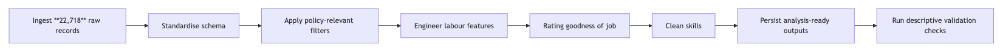
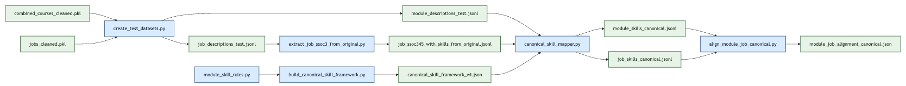
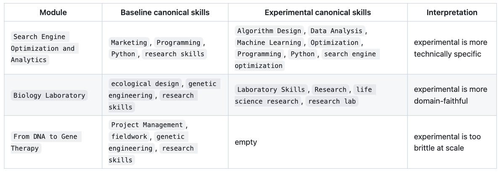
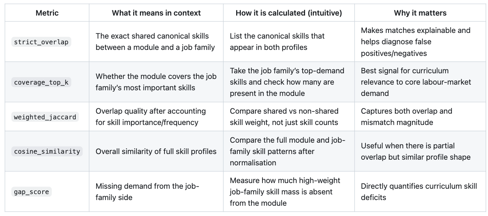
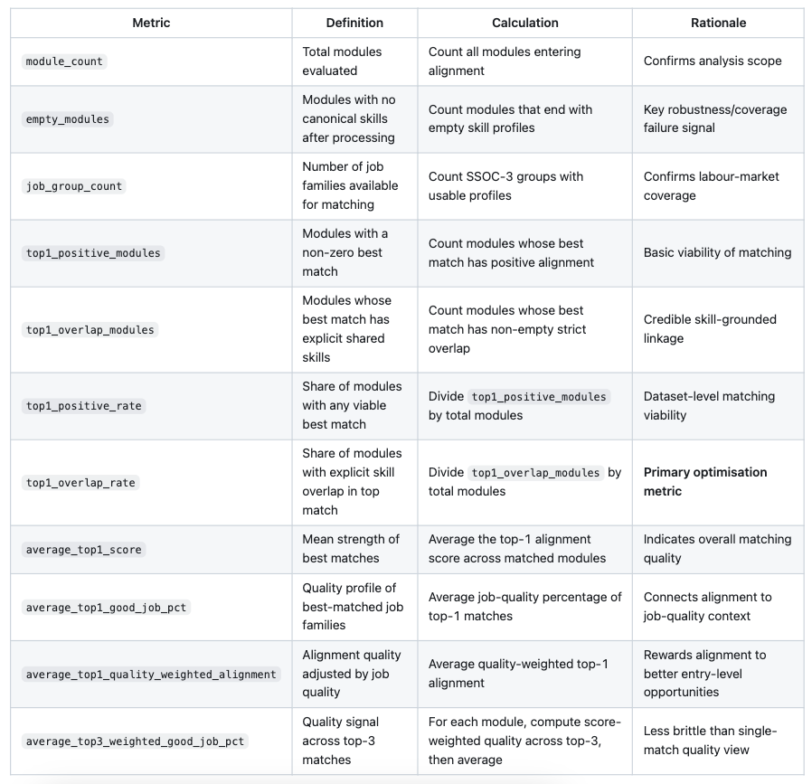
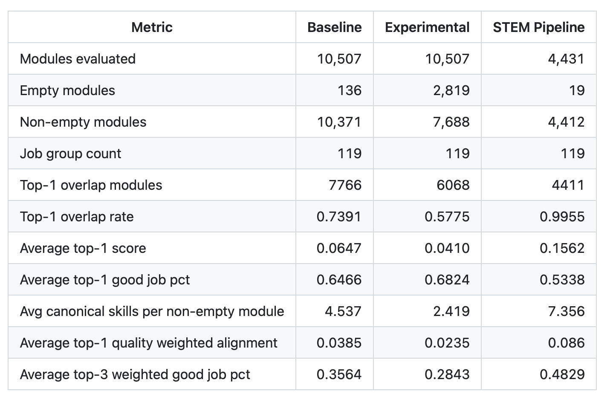

# Technical Report

## 1. Context

In recent years, concerns have emerged over declining employment outcomes among fresh graduates in Singapore. The 2025 Graduate Employment Survey (GES) reported a [decline in full-time permanent employment despite stable median salaries](https://www.straitstimes.com/singapore/parenting-education/fewer-fresh-uni-graduates-in-2025-found-full-time-work-but-pay-held-steady-survey), while surveys indicate [increasing anxiety among graduates on job prospects](https://www.channelnewsasia.com/singapore/fresh-graduates-university-job-search-cna-poll-5288556).

These trends raise important questions about the alignment between higher education and labour market demands. Current analyses rely on aggregate outcomes, lacking visibility into specific skills or curriculum components contributing to employability outcomes. While universities continue to equip students with theoretical knowledge and foundational skills, the evolving nature of industry requirements, driven by technological advancements and shifting economic conditions, may result in a mismatch between what is taught and what employers seek.

Hence, this project answers a key question: **How well are university courses preparing students for real-world jobs?** By analysing job descriptions alongside university course content, we aim to systematically evaluate the extent to which academic curricula align with current industry skill requirements, and to identify potential gaps that may contribute to graduate employment challenges.

## 2. Scope

### 2.1 Problem

**MOE’s Higher Education Policy Division (HEPD)** must ensure university curricula stay aligned with labour market needs. This problem is ongoing and high-frequency: job requirements evolve continuously, while universities update courses on slower academic cycles. Hence, HEPD needs a repeatable way to compare what students are taught against what employers currently demand.

Job ads and course descriptions are **large-scale**, **unstructured**, and continuously changing. Manual reviews and periodic audits are resource-intensive and typically run on multi-year cycles, which limits HEPD’s ability to respond quickly.

The impact is tangible. If alignment is weak, graduates face poorer employment outcomes. Recent graduate employment results have shown declines in full-time employment. Lagged detection of emerging skill gaps delays interventions and reduces policy effectiveness. Without a scalable approach, HEPD risks making decisions on outdated evidence.

Data science and machine learning are appropriate as they directly address scale, variability, and timeliness. **Natural language processing** can extract and standardise skill signals from messy text; **embedding models** can place job and course content in a shared semantic space and quantify alignment using similarity scores; and **automated pipelines** can run continuously, turning a manual, periodic process into near real-time monitoring. This enables faster, more consistent, and evidence-based curriculum policy decisions.

### 2.2 Success Criteria

The project is successful if it helps HEPD and universities **assess alignment of curriculum content with employer demand**, and use this to **improve curriculum planning**. It should also produce practical employability insights by **linking courses to relevant job opportunities and associated market signals**, so HEPD can make better decisions.

Operationally, success means the system can process large unstructured datasets reliably and efficiently through automated workflows, including cleaning, skill extraction, embedding, and matching, **reducing analysis time from manual cycles to repeatable runs**. It should also produce stable, interpretable alignment scores that reflect meaningful skill overlap while minimising noise from irrelevant text.

### 2.3 Assumptions

This project assumes HEPD and universities require a repeatable curriculum-labour monitoring process and have the capacity to review flagged findings. We assume continued access to job and module data, and that stakeholders will use the outputs for prioritisation rather than automated decisions. We also assume directional evidence is decision-useful even if not perfectly predictive. If stakeholder ownership, data access, or review capacity changes, the problem framing, success criteria, and feasibility will change.


## 3. Methodology

### 3.1 Technical Assumptions

We treat job ads and module descriptions as proxies for demanded and taught skills. If either proxy is weak, the model can still compute scores, but those scores will not reflect real curriculum-labour alignment.

Another critical assumption is **extraction recall**. The alignment model only uses extracted module skills, so when extraction is sparse, many modules become effectively unscorable and coverage drops, and performance differences mostly reflect upstream extraction quality rather than true alignment differences.

Finally, we assume canonical mapping makes module and job skills comparable enough for overlap-based scoring at SSOC-3 level. If mapping fails, scores capture wording mismatch instead of substantive skill match, so outputs should be interpreted as relevance signals, not causal evidence.


### 3.2 Data

#### 3.2.1 Jobs Data Cleaning

`data_cleaning_jobs_merged.ipynb` runs as follows:



`data_cleaning_jobs_merged.ipynb` converts 22,718 raw postings into an analysis-ready job dataset focused on **entry-level demand**. Records are first flattened into a standard schema (job metadata, text fields, salary, and SSOC codes), and HTML is removed from descriptions to reduce formatting noise.

Descriptions, salary, employment_type, and skills were cleaned and standardised, and missing `work_type` was inferred within SSOC-3 groups, and generic or duplicate skills were removed. 

##### Definition of a "good job"

```
goodness of job = 0.6 * avg_salary + 0.15 * has_flexible_work + 0.15 * is_permanent_fulltime + 0.1 * vacancy_score 
```

- `avg_salary` gets the highest weight (**0.6**) because income is the most common priority and goal in employment
- `has_flexible_work` adds **0.15** because fleixible work enhances employee well-being and better work-life balance
- `is_permanent_fulltime` adds **0.15** as working full-time in a permanent role gives the most job stability
- `vacancy_score` adds **0.1** due to more job vacancy leading to greater ease of securing employment

Computed goodness of job score is normalised between 0 and 1 to increase interpretability, with 1 being highest score. Good jobs are defined as those with score above 70th percentile, which is added in binary field `is_good_job`. 

The final output (`jobs_cleaned.pkl`) contains **7,104 postings** (**6,448 full-time; 656 part-time**) with an average of **12.76 cleaned skills per posting**, followed by descriptive checks to validate plausibility before downstream modelling.


#### 3.2.2 University Data Cleaning

`data_cleaning_university_merged.ipynb` standardises module data from NUS, NTU and SUTD into one dataset for skill extraction and alignment analysis. Core fields such as `module code`, `title`, `description`, `department` and `university` are harmonised despite source-level schema differences, with NTU department codes mapped via a table (`ntu_dept_mapping.xlsx`).

The dataset was filtered to undergraduate-relevant content by removing records with missing critical fields, minimal descriptions, and modules flagged as postgraduate or out-of-scope faculties. Module descriptions were normalised and cleaned to improve comparability across institutions and support downstream embedding-based analysis.

A unified, consistent dataset is saved as the source of truth for downstream skill mapping and curriculum-job matching. The final output (`combined_courses_cleaned.pkl`) retained module counts of **8,499** (NUS), **1,817** (NTU), and **199** (SUTD), respectively.


#### 3.2.3 Skill Standardisation

A shared canonical framework (`canonical_skill_framework_v4.json`) standardises both module and job skills before alignment. The framework contains **89 canonical skills** and **24 excluded phrases**.


This staged process improves cross-source comparability while limiting brittle phrase mismatch. `module_skill_rules.py` provides additional phrase-to-skill rules, allowed labels, and blocklists to improve consistency on the module side.


### 3.3 Experimental Design

Our baseline, experimental and STEM pipeline converts cleaned modules and jobs into comparable skill profiles, maps them into a shared canonical vocabulary, and computes module-job alignment.

#### 3.3.1 Baseline Pipeline

The baseline workflow (`src/create_test/run_baseline_pipeline.sh`) starts from two cleaned sources: course modules (`combined_courses_cleaned.pkl`) and jobs (`jobs_cleaned.pkl`).



The pipeline has four key stages:

1. `create_test_datasets.py` exports clean module/job datasets.

2. `build_canonical_skill_framework.py` constructs a shared skill vocabulary from canonical labels, aliases, and excluded phrases; this ensures module and job text are compared in the same skill space.

3. `canonical_skill_mapper.py` maps raw phrases to canonical skills using staged logic: normalisation, exclusion checks, exact/alias matching, then semantic fallback (`all-MiniLM-L6-v2`, cosine threshold 0.72).

4. `align_module_job_canonical.py` groups jobs at SSOC-3 and computes module-job alignment scores using coverage, weighted Jaccard, cosine similarity, and a gap penalty.

We then apply a job-quality layer via `good_job_pct` and report both raw alignment and quality-weighted alignment.


#### 3.3.2 Experimental Pipeline

The experimental workflow (`src/create_test/run_experimental_pipeline.sh`) changes only one component: module-side skill extraction. Instead of notebook-derived module skills, `experimental/extract_module_skills_independent.py` extracts skills directly from descriptions using n-gram candidates, MiniLM relevance ranking, rule constraints (`module_skill_rules.py`), and canonical normalisation.

All other components are kept fixed to isolate the causal impact of the extractor change. This is a controlled component-level comparison, not a full pipeline redesign.

The following examples show why this variant was tested; modules can receive more technically specific skill tags under the independent extractor.



#### 3.3.3 STEM Robustness Pipeline

We run a STEM-focused variant of the pipeline to reduce cross-domain noise from non-technical modules, test robustness and check whether alignment behaviour remains stable in a tighter technical scope.

Module scope is determined using a **hybrid STEM classifier**:

1. Modules from predefined STEM faculties/departments are automatically labelled STEM.

2. For the remaining modules, we embed the title and description and compare against STEM and non-STEM prototype centroids.
   - If the margin is strongly positive (`>= 6%`), we classify it as STEM.  
   - If strongly negative (`<= -2%`), block STEM override.

3. If the margin is inconclusive (`-2%` to `6%`), we score sentence-level margins (`±0.04`) and require both:
   - non-negative document margin, and
   - more supporting than opposing sentences (at least +1 net support).

4. If still unresolved, we apply a quantitative STEM keyword rule (`quant_min_score = 2`) with contextual safeguards (false-positive terms, non-STEM context checks, and blocklists).


This layered design prevents isolated technical words from misclassifying non-STEM modules (e.g. humanities descriptions containing terms like “regression”). After STEM scoping, downstream stages remain unchanged, so observed differences are attributable mainly to scope and extraction effects.

Apart from the STEM-specific scoping and module extraction, the `stem_test` pipeline keeps a similar downstream alignment backbone as `baseline`.


#### 3.3.4 Evaluation Metrics

We evaluate the methodology at two levels:

1. **Module-to-job-family matching quality** (does each module map to a plausible labour-demand profile?)
2. **Pipeline-level reliability** (does the method work consistently across the full dataset?)

For model selection, we primarily optimise **`top1_overlap_rate`**, while checking **`empty_modules`** and **`average_top1_score`** as guardrails. This is the most appropriate choice as our goal is not just high similarity scores, but **credible, skill-grounded matches** between modules and job families at scale.

**Alignment component metrics (used inside module-job scoring)**

 

The final alignment score is a weighted blend with **heuristic, policy-facing priorities**:

`alignment_score = 0.4 * coverage + 0.25 * weighted_jaccard + 0.2 * cosine_similarity + 0.15 * (1 - gap_score)`

- `coverage_top_k` gets the highest weight (**0.40**) because teaching the most demanded job-family skills is the primary objective.
- `weighted_jaccard` gets **0.25** to reward stronger weighted overlap and penalise broad mismatch.
- `cosine_similarity` gets **0.20** as a secondary global-similarity signal.
- `(1 - gap_score)` gets **0.15** to penalise missing important skills without over-dominating the score.

This weighting prioritises core-skill coverage and is refined with broader similarity and explicit gap penalties.

**Pipeline-level evaluation metrics (reported at dataset level)**
  


### 3.3 Chatbot 

Our chatbot enables job query in natural language, surface the most relevant job listings, and explain which university modules best match the skills employers are asking for based on the baseline canonical pipeline. 


## 4. Findings

### 4.1 Results

The three pipelines are compared on common dataset-level metrics.



The pipeline results show a clear pattern. `baseline` performs best as a **general-purpose** pipeline, `experimental` produces more specific skills for some modules but less robust overall, and `STEM` performs best **within a narrow STEM scope**.

The baseline provides the best balance of coverage and match quality on the full module universe. It retains high usable coverage (10,371 non-empty modules out of 10,507), achieves a strong top-1 overlap rate (0.7391), and has a higher average top-1 score (0.0647) than the experimental pipeline.

The additional job-quality layer suggests top matches are linked to job families with moderate quality concentration, with `average_top1_good_job_pct = 0.6466`, `average_top1_quality_weighted_alignment = 0.0385` and `average_top3_weighted_good_job_pct = 0.3564`.

The experimental pipeline only changes the module-side extraction (controlled test). Skill specificity improved for some modules (as explained in [Section 3.3.2](#332-experimental-pipeline)), but overall performance is weaker. The main issue is coverage loss: empty modules increase from 136 (baseline) to 2,819, with corresponding declines in top-1 overlap (0.5775) and average top-1 score (0.0410). This originates from upstream independent extraction, before canonical mapping.

The STEM pipeline delivers very strong in-scope performance, with only 19 empty modules out of 4,431, near-complete top-1 overlap (0.9998), higher average top-1 score (0.1571), and more canonical skills per non-empty module (7.356), contributing to stronger matches. These results should be interpreted as evidence of strong in-domain performance. STEM modules tend to use more standardised technical language, making them easier to classify and align.

Overall, the **baseline** should remain the primary workflow for general deployment because it is the most reliable across the full dataset. The **experimental** extractor is better suited for targeted R&D use in technical domains, while the **STEM** workflow is most useful for focused policy analysis within STEM disciplines.

### 4.2 Discussion

Our findings are most useful as a **decision-support signal** for curriculum review rather than a direct measure of graduate readiness.

The main business value is that unstructured job and course text can be transformed into consistent indicators that HEPD can monitor over time. Metrics such as empty-module rate, overlap rate, and alignment score show where curriculum coverage appears strong, where confidence is lower, and where further review may be needed.

These metrics also have operational value. Lower empty-module rates reduce the manual fallback work required. Higher overlap rates mean more modules can be linked to plausible job clusters, improving departmental summaries and reducing blind spots. Stable outputs across refresh cycles also make it easier to compare results over time and reduce risk from one-off interpretations.

Results should be interpreted relatively. Alignment scores are expected to be modest because a single module captures only part of a job’s full competency bundle. The main value is not the exact score itself, but its ability to identify patterns (e.g. persistent skill gaps, weakly aligned module groups, and areas that require targeted review).

Canonical skill mappings and SSOC-linked top matches provide a traceable path from source text to final scores, making outputs easier to review. The reproducible workflow makes deployability realistic.

Overall, the business problem is **partially addressed**. The system is strong enough for structured monitoring and prioritisation, but not yet suitable for fully automated, high-stakes policy decisions.


### 4.3 Limitations, Biases, Ethical Considerations

Our analysis has several limitations.

Firstly, **data coverage is constrained**. The job dataset is derived from a short MyCareersFuture snapshot, which may capture temporary demand patterns rather than stable labour-market demand. Job-role filtering is rule-based (e.g. `minimum_years_experience` and keyword exclusions), which can introduce false positives and false negatives. Job skills also depend on employer-entered fields with uneven quality, potentially overrepresenting generic soft skills and undercapturing technical requirements expressed in free text. For modules, coverage is limited to three universities and catalogue-level module descriptions, without full syllabus or assessment evidence.

Secondly, **modelling choices introduce uncertainty**. STEM scope classification combines metadata and semantic rules and may misclassify edge cases, especially for interdisciplinary modules. Canonical mapping improves consistency, but it may collapse distinctions that matter in practice or maintain distinctions that are not meaningful to employers. Hence, output quality remains sensitive to taxonomy design, extraction thresholds, and mapping logic.

Thirdly, **interpretation should remain cautious**. Module-job similarity is a relevance signal, not causal evidence of programme effectiveness or graduate readiness. High alignment does not guarantee employment outcomes, and low alignment does not imply low educational value. These results should be interpreted alongside external evidence, including internships, graduate outcomes, and employer validation.

Lastly, **labour-market bias and interpretation risks are important considerations**. Employer language in job ads should not be treated as an objective labour-market truth. A skill-overlap framing may systematically favour domains with standardised technical vocabulary and understate strengths in humanities or interdisciplinary programmes. If used without safeguards, the framework could encourage overreaction to short-term demand and underinvestment in foundational and transferable capabilities. Human review, periodic taxonomy audits, and discipline-specific interpretation are therefore necessary before high-stakes policy use.


### 4.4 Recommendations

Our project has the potential to create business value for MOE HEPD and universities. The appropriate next step is **staged deployment** rather than immediate full-scale operationalisation.

We should first deploy the system as an internal decision-support tool through a **controlled pilot** (e.g. STEM-focused or selected faculties). Expansion should proceed only if key conditions are met over repeated refresh cycles: low and stable empty-module rates, reproducible outputs, and analyst validation that sampled matches are substantively plausible and useful for policy workflow.

Next, **high-impact data constraints should be addressed before broader rollout**. Job data should be expanded beyond a one-week single-source snapshot to include **additional job portals** (e.g. LinkedIn, Careers@Gov) and a **longer time horizon**. Graduate role labelling should move beyond simple experience filters, and job-side extraction should incorporate richer free-text signals. On the curriculum side, incorporating **more detailed syllabus and assessment information (where feasible)** is likely to improve alignment quality more than further tuning of scoring weights alone.

From a cost perspective, deployment is feasible but requires **deliberate investment** in ingestion automation, workflow orchestration, quality checks, reporting interfaces, and ongoing taxonomy maintenance. These costs are justified if the system reduces manual audit burden and improves the timeliness of curriculum-risk detection. If pilot criteria are not met after planned iterations, the project should be narrowed to exploratory analytics or closed. If criteria are met, the system should be institutionalised as a recurring monitoring capability that informs, but does not replace, expert policy judgment.
