```mermaid
flowchart LR
    A["combined_courses_cleaned.pkl"] --> C["create_test_datasets.py"]
    B["jobs_cleaned.pkl"] --> C["create_test_datasets.py"]
    C --> D["module_descriptions_test.jsonl"]
    C --> E["job_descriptions_test.jsonl"]
    F["module_skill_rules.py"] --> G["build_canonical_skill_framework.py"]
    G --> H["canonical_skill_framework_v4.json"]
    E --> I["extract_job_ssoc3_from_original.py"]
    I --> J["job_ssoc345_with_skills_from_original.jsonl"]
    D --> K["canonical_skill_mapper.py"]
    J --> K["canonical_skill_mapper.py"]
    H --> K
    K --> L["module_skills_canonical.jsonl"]
    K --> M["job_skills_canonical.jsonl"]
    L --> N["align_module_job_canonical.py"]
    M --> N
    N --> O["module_job_alignment_canonical.json"]

    classDef script fill:#dceeff,stroke:#24557a,stroke-width:1.5px,color:#102a43;
    classDef data fill:#e8f5e9,stroke:#2f6b3a,stroke-width:1.5px,color:#183a1d;

    class C,G,I,K,N,F script;
    class A,B,D,E,H,J,L,M,O data;
```

# Technical Report: 

## 1. Context and Objective

This project studies how well university curricula prepare students for real-world jobs. Within that broader objective, `data_cleaning_jobs_merged.ipynb` is one of the core preprocessing notebooks for labour-market demand data. Its role is to transform raw MyCareersFuture-style job posting JSON files into a structured, analysis-ready dataset that can later be compared against university course content and extracted skill profiles.

The public-sector relevance is direct. If a ministry, workforce agency, or public university wants to evaluate whether graduates are being trained for current market demand, the first requirement is a reliable view of entry-level job opportunities. Raw job postings are noisy, duplicated, semi-structured, and operationally inconsistent. Without a defensible cleaning pipeline, any downstream skill-gap analysis would risk misleading policy decisions, such as over-prioritising transient employer language, underestimating graduate-ready opportunities, or drawing conclusions from internship-heavy data that do not reflect full-time labour-market demand.

This notebook therefore acts as a governance layer between raw postings and higher-level analytics. It narrows the dataset to fresh-graduate-relevant roles, standardises job attributes, normalises skills, and produces summary analyses that help stakeholders understand both the resulting dataset and the shape of the entry-level market. In practical terms, it supports evidence-based decisions on curriculum review, graduate employability initiatives, and early-stage manpower planning.

### 1.1 Project Scope

#### 1.1.1 Problem

- State the full project question explicitly:
  - how well do Singapore university courses prepare students for real-world jobs?
- Define the comparison unit:
  - university modules and their extracted skill signals
  - fresh-graduate-relevant job postings and their extracted skill demand
- Clarify why this matters in a public-sector context:
  - curriculum review
  - graduate employability
  - workforce planning
  - evidence-based policy decisions on higher education and manpower alignment

#### 1.1.2 Success Criteria

- Define what successful project delivery looks like:
  - cleaned and analysis-ready job dataset
  - cleaned and analysis-ready university course dataset
  - reproducible downstream pipelines for alignment analysis
  - interpretable outputs for technical and policy stakeholders
- Add technical success criteria:
  - robust preprocessing from noisy raw data
  - stable canonical skill mapping
  - reproducible baseline and STEM workflows
  - clear experimental comparison path
- Add analytical success criteria:
  - ability to compare course-side and job-side skills at scale
  - ability to identify strong alignment and likely skill gaps
  - ability to produce findings useful for curriculum discussion

#### 1.1.3 Assumptions

The `data_cleaning_jobs_merged.ipynb` notebook makes several important assumptions:

- Fresh-graduate-friendly roles can be approximated using `minimum_years_experience` equal to 0 or 1.
- Internship and postgraduate roles should be excluded because the project focuses on undergraduate-to-workforce alignment rather than internships or advanced academic labour markets.
- Employer-provided skills are sufficiently informative to serve as a proxy for job-skill demand once normalised.
- Repeated postings with the same title and description do not add analytical value and should be deduplicated.
- For unknown work types, SSOC group patterns and salary levels provide a reasonable fallback for imputation.

These assumptions are defensible for a labour-market alignment study, but they also define the limits of interpretation. The resulting dataset is best understood as a curated view of entry-level demand rather than a complete representation of all possible graduate transitions.

#### 1.1.4 Stakeholders

- Identify the main stakeholders:
  - public universities
  - workforce agencies
  - ministries involved in higher education and manpower planning
  - students and recent graduates
- Add what each stakeholder cares about:
  - curriculum relevance
  - employability outcomes
  - demand for technical and transferable skills
  - resource prioritisation for programme updates
- Explain how the project outputs support stakeholder decision-making:
  - alignment summaries
  - interpretable skills comparisons
  - reusable data pipelines that can be refreshed with new data

#### 1.1.5 Deliverables

- List the main deliverables of the project:
  - cleaned jobs dataset
  - cleaned university courses dataset
  - baseline alignment pipeline
  - experimental comparison pipeline
  - STEM-specific alignment pipeline
  - technical report and supporting artifacts
- Note where these deliverables live in the repository:
  - `src/notebooks/`
  - `src/create_test/`
  - `src/stem_test/`
  - `data/cleaned_data/`
  - `data/test/`

## 2. Data and Cleaning

### 2.1 Jobs Data Cleaning

#### 2.1.1 Notebook Workflow

Methodologically, the notebook follows a standard data engineering pattern:

1. Ingest raw semi-structured JSON records.
2. Standardise nested fields into tabular columns.
3. Filter for the target population of interest.
4. Engineer interpretable features.
5. Clean and regularise skills.
6. Persist analysis-ready outputs.
7. Run descriptive analyses to validate whether the cleaned dataset reflects plausible labour-market patterns.

This sequence separates structural cleaning from analytical interpretation while keeping both in the same artifact for transparency.

#### 2.1.2 Project-Wide Pipeline Overview

- Add a short end-to-end overview of the full project workflow:
  - raw job and module data acquisition
  - scraper outputs
  - notebook-based cleaning
  - downstream dataset construction
  - canonical skill mapping
  - module-job alignment
- Clarify that the report should ultimately cover the full project system, not only the jobs notebook.
- State that the notebook-cleaned PKL files are now the source of truth for downstream workflows.
- Mention the standardized shell-script entrypoints for the supported pipelines.

#### 2.1.3 Data Collection and Ingestion

The loader searches `../../data` recursively for files whose names begin with `MCF-`, falling back to a `job` subdirectory only if needed. This is a robust engineering decision because it prioritises the intended project data while remaining resilient to folder reorganisation. During execution, the notebook discovered **22,718 raw JSON files** and loaded **22,718 job rows**.

Each record is flattened into a structured row with fields such as:

- `uuid`
- `title`
- `description`
- `minimum_years_experience`
- `skills`
- `employment_types`
- `position_levels`
- `categories`
- `salary_minimum`, `salary_maximum`
- posting and expiry dates
- `ssoc_code` and `ssoc_version`

The notebook also strips HTML from descriptions using `BeautifulSoup`, which is important because job descriptions are often stored as HTML fragments rather than plain text. This reduces noise before text-based filtering and makes length checks more meaningful.

#### 2.1.4 Targeted Cleaning for Graduate-Relevant Roles

The first major cleaning stage aligns the dataset to the project objective: identifying labour demand relevant to undergraduates and recent graduates.

The pipeline applies the following filters:

- Keep only postings with `minimum_years_experience` in `{0, 1}`.
- Drop rows missing title or description.
- Remove descriptions with fewer than 10 words.
- Remove internships using title, description, and employment-type signals.
- Remove likely postgraduate roles using title cues such as "research fellow" or "assistant professor".
- Remove postings whose descriptions strongly indicate postgraduate qualifications, including PhD or Master's requirements.
- Deduplicate records using the pair `(title, description)`.

The observed row counts show the effect of each stage:

| Stage | Rows Remaining |
|---|---:|
| Raw loaded postings | 22,718 |
| After experience filter | 9,477 |
| After description filter | 9,476 |
| After undergraduate-only filter | 8,834 |
| After deduplication | 7,115 |
| After skill thresholding | 7,104 |

These filters demonstrate robustness in two ways. First, they address known data quality issues such as sparsity and duplication. Second, they encode domain logic rather than relying on generic preprocessing. In a public-sector context, that matters because the distinction between internship, graduate, and postgraduate pipelines is policy-relevant: interventions for undergraduate curriculum design should not be distorted by jobs intended for researchers or late-stage professionals.

#### 2.1.5 Employment Type, Salary, and Imputation Logic

The notebook derives `contract_type` and `work_type` from employer-provided `employment_types`, mapping values into interpretable categories such as `Permanent`, `Contract`, `Temporary`, `Freelance`, `Full Time`, and `Part Time`.

If both contract type and work type are unknown, the row is removed. This avoids carrying forward records with insufficient labour-market signal.

The notebook then converts salary fields to numeric format and computes `avg_salary` as the rounded mean of minimum and maximum salary. For work type, the notebook implements a two-step imputation strategy:

- First, infer likely work type using the modal observed work type within the same 3-digit SSOC group.
- If SSOC-based inference is unavailable, fall back to a salary threshold derived from the median salaries of known full-time and part-time jobs.

It compromises between practical utility and interpretability. It is more principled than filling all missing work types with the dominant class, because it uses occupational structure first and only uses salary as a weaker fallback. In public-sector analytics, such hierarchy-based imputation is preferable because it better preserves real labour-market structure.

After cleaning, the final job dataset contains:

- **7,104 rows**
- **6,448 full-time postings**
- **656 part-time postings**
- Contract types dominated by `Unknown` (3,133) and `Permanent` (2,781), followed by `Contract` (804), `Temporary` (331), and `Freelance` (55)

The large `Unknown` contract-type share is itself an important analytical finding: it reflects incomplete source metadata and should be acknowledged in any downstream interpretation.

#### 2.1.6 Skill Normalisation and Frequency Filtering

The skill cleaning process has several stages:

1. Lowercase and trim raw skills.
2. Save raw skill frequencies to Excel for auditability.
3. Normalise punctuation and spacing.
4. Remove explicitly low-value labels such as `team player`, `able to work independently`, and `physically fit`.
5. Collapse variants of common soft skills into shared canonical forms, such as mapping phrases containing "communication" to `communication`.
6. Protect selected exact multi-word skills such as `project management` and `data management` from over-collapsing.
7. Remove within-row near-duplicates using fuzzy matching (`SequenceMatcher`).
8. Keep only skills that appear at least three times across the dataset.
9. Remove jobs with fewer than three cleaned skills.

This design balances precision and recall. If the notebook kept every raw employer phrase, the analysis would be overwhelmed by lexical variation and boilerplate. If it over-normalised aggressively, it would erase meaningful distinctions between technical competencies. The use of exact-keep exceptions and fuzzy deduplication shows good practical understanding of this trade-off.

The final distribution of skill counts is plausible for job postings:

- Mean number of skills per posting: **12.76**
- Median: **13**
- Interquartile range: **10 to 15**
- Minimum retained: **3**
- Maximum retained: **20**

The notebook also exports raw and cleaned skill-frequency tables to Excel, which is valuable for stakeholder review. Non-technical reviewers can inspect the vocabulary and challenge cleaning rules if necessary, making the process more governable.

#### 2.1.7 Output Structure and Reusability

The cleaned dataset is saved as `data/cleaned_data/jobs_cleaned.pkl`. Before saving, the notebook drops intermediate helper columns and reorders the final schema so downstream consumers receive a compact, consistent table.

This is good execution practice. Instead of passing along every temporary artifact created during cleaning, the notebook separates internal processing columns from production-facing outputs. That makes later analysis cleaner and reduces accidental dependency on unstable intermediate fields.

#### 2.1.8 Descriptive Validation and Exploratory Analysis

The second half of the notebook performs descriptive analysis on the cleaned data. This is not merely exploratory; it acts as a validation layer. If the top titles, skill distributions, and data-role patterns were obviously implausible, that would signal a problem in the cleaning pipeline.

Examples from the cleaned dataset include:

- Most common entry-level titles: `warehouse assistant` (31), `admin assistant` (24), `administrative assistant` (20), `sales executive` (19), `accounts assistant` (19)
- Most common skills overall: `Team Player` (2,857), `Customer Service` (2,114), `Interpersonal Skills` (2,059), `Communication Skills` (1,718), `Microsoft Office` (1,677)
- Titles with the widest skill range include `business development executive` (110 unique skills) and `marketing executive` (99 unique skills)

The notebook also isolates a subset of data-related roles using keyword matching. This subset contains **29 postings**, with top skills including `SQL` (14), `Data Analysis` (12), `Python` (12), `Business Analysis` (10), and `Business Requirements` (10). Median salary in this subset is **5,000**, with most postings marked as full-time.

These summaries directly support the broader project objective. They show what employers actually ask for and create a bridge to course-side skill extraction. For a university or public-sector workforce unit, this is the dataset that can later be matched against curriculum content to identify alignment gaps.

### 2.2 University Data Cleaning

#### 2.2.1 University Course Cleaning Methodology

- Add a matching methodology subsection for `data_cleaning_university_merged.ipynb`.
- Describe the course-side data sources:
  - NUSMods API
  - NTU scraper outputs and department mapping
  - SUTD scraper outputs
- Explain how module descriptions were cleaned and standardized.
- Document the cleaned course schema:
  - `code`
  - `title`
  - `department`
  - `description`
  - `university`
  - skill-related fields stored in the cleaned PKL
- Explain how module-side skills were produced in the notebook:
  - `skills_embedding`
  - `hard_skills`
  - `soft_skills`
- Add university-side data-quality issues:
  - missing descriptions from NTU and SUTD
  - uneven metadata richness across universities
  - department or faculty inconsistencies

## 3. General Pipeline

### 3.1 Downstream Baseline Pipeline

The official general workflow lives in `src/create_test/` and starts from the notebook-cleaned PKLs `data/cleaned_data/combined_courses_cleaned.pkl` and `data/cleaned_data/jobs_cleaned.pkl`. These PKLs are the source of truth for downstream analysis. The baseline pipeline is the main system used to answer the project question because it converts those cleaned datasets into comparable skill profiles, maps them into a shared canonical vocabulary, and evaluates module-job alignment in a reproducible way. The full workflow can be run via `bash src/create_test/run_baseline_pipeline.sh`.

#### 3.1.1 Pipeline Inputs and Export Layer

`create_test_datasets.py` converts the PKLs into downstream JSON/JSONL artifacts. It standardizes row identity, using `university::code` for modules and `uuid` for jobs, applies a final normalized description-length filter, and exports the fields needed by later stages. On the module side, the export preserves the notebook-derived `skills`, `hard_skills`, and `soft_skills` fields. On the job side, it preserves SSOC, work-type, salary, and cleaned skill fields. In full-dataset mode, it produced **10,507 module rows** and **7,104 job rows**.

#### 3.1.2 Canonical Skill Framework Construction

`build_canonical_skill_framework.py` constructs the shared vocabulary used by both module-side and job-side mapping. The output, `data/reference/canonical_skill_framework_v4.json`, stores canonical skill labels, skill types, aliases, notes, and excluded phrases. The current framework contains **89 canonical skills** and **24 excluded phrases**. This framework is needed because direct phrase overlap is too brittle: semantically similar skills often appear in different surface forms across module descriptions and job postings.

#### 3.1.3 Role of `module_skill_rules.py`

`module_skill_rules.py` defines the module-side skill vocabulary used across the project. It was built by reviewing recurring phrases in module descriptions, grouping lexical variants under one canonical skill label, and filtering phrases that were too broad, too academic, or too pedagogical to function as useful occupational skills. The aim was to preserve practical competencies such as `machine learning`, `sql`, or `corporate governance` while filtering generic terms such as `course`, `module`, `analysis`, or `design`. The file contains phrase-to-skill rules (`MODULE_SKILL_RULES`), allowed canonical labels (`CANONICAL_MODULE_SKILLS`), evidence constraints (`STRICT_CANONICAL_EVIDENCE`), and blocklists. In the baseline pipeline, these rules help build the canonical framework. In the experimental and STEM pipelines, the same rule base is reused during module-skill extraction.

#### 3.1.4 Job-Side SSOC Enrichment

`extract_job_ssoc3_from_original.py` converts the cleaned job dataset into grouped labour-demand inputs indexed by SSOC hierarchy. It parses each raw SSOC field into 5-digit, 4-digit, and 3-digit codes, looks up the corresponding titles from `ssoc2020.xlsx`, and writes flattened job rows containing the SSOC hierarchy and a deduplicated job-side skill list. On the full baseline run, all **7,104** job rows were preserved at this stage.

#### 3.1.5 Canonical Mapping

`canonical_skill_mapper.py` maps raw skill phrases into the shared framework for both modules and jobs. Each phrase is normalized, checked against the excluded-phrase set, matched exactly against aliases where possible, and otherwise mapped semantically using `sentence-transformers/all-MiniLM-L6-v2`. The semantic fallback uses a cosine-similarity threshold of **0.72**; phrases below the threshold are retained as unmapped rather than forced into an incorrect canonical label. The mapper writes row-level canonical skill lists and phrase-level mapping details, including the raw phrase, normalized phrase, match type, and score. On the full baseline run, **10,507** module rows and **7,104** job rows were canonicalised.

#### 3.1.6 Alignment Logic

`align_module_job_canonical.py` compares each module against grouped job demand in canonical skill space. Jobs are grouped at the **3-digit SSOC level**, producing **119 job groups** in the current run. For each SSOC group, the script aggregates canonical job skills into a weighted profile. For each module, it then compares the module skill profile against every job-group profile using four signals: top-`k` coverage, weighted Jaccard overlap, cosine similarity, and a gap score that measures missing high-weight job skills. These are combined into one composite score:

`alignment_score = 0.4 * coverage + 0.25 * weighted_jaccard + 0.2 * cosine_similarity + 0.15 * (1 - gap_score)`

The script keeps the top job-group matches for each module and reports dataset-level summary metrics. On the full baseline run, the results were `module_count = 10,507`, `empty_modules = 136`, `job_group_count = 119`, `top1_overlap_rate = 0.7391`, and `average_top1_score = 0.0647`. This is the primary pipeline used to answer the project question because it preserves the notebook-derived module skill signal and gives the strongest combination of coverage and alignment performance across the full module universe.

### 3.2 Experimental Comparison

The supported experimental workflow lives in `src/create_test/experimental/` and can be run via `bash src/create_test/run_experimental_pipeline.sh`. It is a controlled comparison of one modelling choice: the module-skill extraction strategy. The baseline pipeline uses the module-side skill fields already stored in the cleaned course PKL. The experimental pipeline keeps the rest of the system fixed and replaces only that module-side extraction step with `experimental/extract_module_skills_independent.py`, isolating the effect of module-side extraction without changing the rest of the modelling stack.

#### 3.2.1 Controlled Comparison Design

The comparison is intentionally narrow. It uses the same module rows, job rows, SSOC enrichment, canonical framework, mapping logic, and alignment function as the baseline pipeline. Only the module-side skill source changes, so downstream differences are driven mainly by the extraction strategy.

#### 3.2.2 Independent Module Skill Extraction

The independent extractor reads the same module descriptions as the baseline pipeline but derives skills directly from description text. It generates candidate phrases with an n-gram vectorizer, embeds descriptions and candidate phrases with `all-MiniLM-L6-v2`, ranks candidates by semantic relevance, applies rule-based matches from `module_skill_rules.py`, filters broad academic phrases, and semantically normalizes the surviving phrases into the same canonical module-skill space. We tested this approach because some baseline examples looked too generic. For example, `Search Engine Optimization and Analytics` looked marketing-heavy under the baseline but yielded `search engine optimization`, `Data Analysis`, `Machine Learning`, `Optimization`, and `Algorithm Design` under the independent extractor, while `Biology Laboratory` produced more domain-faithful laboratory skills.

#### 3.2.3 Experimental Results and Failure Mode

Although the independent extractor produced stronger examples in some technical cases, it performed much worse at the dataset level. On the same full dataset of **10,507 modules**, the baseline left **136** empty modules while the experimental pipeline left **2,819**. The baseline achieved a **top-1 overlap rate of 0.7391** and an **average top-1 score of 0.0647**, compared with **0.5775** and **0.0410** for the experimental pipeline. The key technical finding is that this failure occurred upstream of canonical mapping: the empty rows in `module_skills_canonical_independent.jsonl` were already empty in `module_descriptions_test_with_skills_independent.jsonl`.

Table 1 summarizes the baseline-versus-experimental comparison on the full dataset.

| Metric | Baseline | Experimental |
|---|---:|---:|
| Modules evaluated | 10,507 | 10,507 |
| Empty modules | 136 | 2,819 |
| Non-empty modules | 10,371 | 7,688 |
| Top-1 overlap rate | 0.7391 | 0.5775 |
| Average top-1 score | 0.0647 | 0.0410 |
| Avg canonical skills per non-empty module | 4.537 | 2.419 |

These metrics describe three aspects of performance. `Top-1 overlap rate` measures coverage: the share of modules whose best-matching job group contains at least one overlapping canonical skill. `Average top-1 score` measures the strength of that best match and should be interpreted comparatively rather than absolutely. `Avg canonical skills per non-empty module` measures how much skill information each pipeline retains once empty rows are excluded. Together, the table shows that the baseline pipeline preserves a richer module-side signal, produces overlap for more modules, and yields stronger best-match alignments on average.

Table 2 shows representative module-level examples. These examples explain both why the independent extractor was worth testing and why it was not retained as the final model.

| Module | Baseline canonical skills | Experimental canonical skills | Interpretation |
|---|---|---|---|
| `Search Engine Optimization and Analytics` | `Marketing`, `Programming`, `Python`, `research skills` | `Algorithm Design`, `Data Analysis`, `Machine Learning`, `Optimization`, `Programming`, `Python`, `search engine optimization` | experimental is more technically specific |
| `Biology Laboratory` | `ecological design`, `genetic engineering`, `research skills` | `Laboratory Skills`, `Research`, `life science research`, `research lab` | experimental is more domain-faithful |
| `From DNA to Gene Therapy` | `Project Management`, `fieldwork`, `genetic engineering`, `research skills` | empty | experimental is too brittle at scale |

#### 3.2.4 Final Decision from the Comparison

The final modelling decision was to keep the baseline pipeline as the official general workflow. The comparison showed a clear trade-off: the independent extractor could be more accurate for some technical modules, but it was also much lower-coverage and less robust across the full dataset. In short, it was more specific when it worked, but too brittle to serve as the main reporting model. The same comparison motivated the next step of the project: testing a STEM-only pipeline as a robustness check.

## 4. STEM Robustness Analysis

We introduced a STEM-focused test to reduce cross-domain noise in module-job matching. In the full module universe, many modules are intentionally non-technical or mixed-context, which can dilute technical-skill signals and make alignment scores harder to interpret for workforce-oriented technical roles. By scoping to STEM, we test whether alignment patterns remain consistent under a more technically coherent module set, and to check for robustness and sensitivity.

### 4.1 STEM Classification and Pipeline

We classify modules into STEM and non-STEM using a hybrid method that combines university-specific metadata classification with semantic text understanding at the paragraph, sentence and keyword levels. Firstly, we mapped modules offered by each university’s STEM-focused departments/faculties as STEM.

For all other modules, we ran an **embedding-based paragraph classifier**, considering the semantic meaning of the module title and description. We used `sentence-transformers` to compare module embeddings with manually constructed STEM and non-STEM prototype centroid texts. The model calculated `stem_similarity`, `non_stem_similarity`, and `margin = stem_similarity - non_stem_similarity`. If `margin` is strongly negative (`<= -2%`, suggesting non-STEM dominates), we block the STEM override. For strongly positive margin (`>= 6%`, suggesting STEM dominates), we classify as a STEM module. This prevents isolated STEM keywords like “regression” influencing clearly non-STEM contexts.

For non-decisive paragraph semantics (`-2% < margin < 6%`), we evaluate **sentence-level semantic scoring** as a tie-breaker. We compare each sentence’s STEM vs non-STEM similarity margin and count supporting versus opposing sentences using a fixed margin threshold (`±0.04`). We then apply a STEM override only if the overall document margin is non-negative and supporting evidence exceeds opposing evidence by at least one sentence (`support_count - oppose_count >= 1`).

If semantic overrides still do not trigger, we apply a final keyword fallback (`quant_min_score = 2`) with contextual safeguards (false positives, quantitative-term blocklists, non-STEM context checks).

Apart from the STEM-specific scoping and module extraction, the `stem_test` pipeline keeps the same downstream alignment backbone as `create_test` **[include a hyperlink!!!!]** (shared canonical framework, canonical mapper, and SSOC-based alignment). A Sankey step is also added to make the decision flow auditable.

### 4.2 Canonical Skill Framework

- Add a subsection explaining what the canonical framework is and why it is needed.
- Explain the problem it solves:
  - lexical variation across job and module skills
  - the need for a shared skill vocabulary before alignment
- Describe what is stored in the framework:
  - canonical skill label
  - skill type
  - aliases
  - excluded phrases
- State that the framework is now shared across the baseline and STEM pipelines.
- Explain why centralising it improves consistency and reproducibility.

### 4.3 Alignment Methodology

- Add a subsection explaining how module-job alignment is computed.
- Describe the use of canonical skill overlaps and job-group aggregation.
- Explain the role of SSOC grouping in structuring job demand.
- Summarise the scoring logic in plain language:
  - overlap
  - coverage
  - weighted similarity
  - gap interpretation
- Explain what the final output means for stakeholders:
  - indicative alignment, not causal proof
  - useful for curriculum review and prioritisation

### 4.4 Reproducibility and Repository Design

- Add a subsection documenting the repo cleanup and standardisation work.
- Explain how the repo is organized into:
  - baseline
  - experimental
  - STEM
  - legacy
- Mention the addition of shell-script shortcuts.
- Explain why this matters:
  - easier onboarding
  - easier reruns
  - clearer distinction between supported and exploratory code paths
- Mention any validation performed:
  - dry runs
  - pipeline output checks
  - consistency checks across frameworks

## 5. Findings and Implications

### 5.1 Robustness

The notebook performs strongly on robustness.

- It handles nested, inconsistent JSON structures through explicit extraction functions rather than ad hoc one-off parsing.
- It accounts for multiple forms of data quality problems: HTML contamination, missing values, duplication, noisy skill labels, weak descriptions, and unknown employment metadata.
- It includes a meaningful imputation strategy for work type instead of silently discarding all partially incomplete records.
- It creates auditable artifacts, including Excel exports for raw and cleaned skill frequencies.

From a public-sector perspective, the strongest robustness feature is its domain-aware filtering. The notebook does not treat all job postings as equally relevant. It explicitly models the difference between fresh-graduate opportunities and other labour-market segments. That is essential when outputs may influence curriculum review or manpower policy discussions.

### 5.2 Execution

There are, however, still limitations:

These do not undermine the core cleaning pipeline, but they are important if the notebook is intended to serve as a polished production artifact.

- Add a subsection evaluating execution for the full project, not only the jobs notebook:
  - code organisation
  - reproducibility
  - readability
  - documentation
  - pipeline standardisation
- Mention the creation of shell shortcuts and clearer folder structure.
- Mention which parts of the project are now officially supported versus legacy.
- Explain how the final repository design improves maintainability and handoff.

### 5.3 Communication

- Add an explicit communication subsection aligned with the rubric.
- Evaluate:
  - whether the outputs are interpretable
  - whether the pipeline is understandable to a new user
  - whether the README and technical report are clear enough for both technical and non-technical readers
- Reference visual aids or propose visual aids that should appear in the report:
  - pipeline diagram
  - data attrition chart
  - alignment summary table
  - baseline vs experimental comparison table

### 5.4 Project Findings

- Add the actual end-to-end findings of the project here.
- Suggested points to include:
  - what the baseline alignment results suggest
  - what types of modules align well with job demand
  - where likely skill gaps appear
  - what the STEM-focused analysis shows
  - whether the experimental extractor materially changes the results
- Translate these findings into stakeholder-relevant takeaways:
  - curriculum review
  - employability programming
  - areas requiring deeper manual validation

### 5.5 Policy and Stakeholder Implications

- Add a subsection that connects findings to public-sector decision-making.
- Explain how ministries, universities, and workforce agencies could use the outputs.
- Clarify what decisions the project can support and what decisions it cannot support on its own.
- Note that the outputs are best treated as evidence for prioritisation and review, not automatic policy prescriptions.

## 6. Limitations and Future Work

### 6.1 Limitations, Biases, and Ethical Considerations

Several limitations should be stated explicitly.

First, the graduate filter is rule-based. Using `minimum_years_experience` in `{0,1}` is practical, but some graduate-suitable jobs may require 2 years, while some 0-1 year roles may still be unsuitable for typical undergraduates.

Second, postgraduate-role exclusion relies on keyword patterns in titles and descriptions. This improves precision, but it may still generate both false positives and false negatives.

Third, skill extraction depends on employer-supplied structured skill fields. Employers vary widely in how carefully they populate these fields. As a result, common soft skills may be overrepresented, while some technical competencies may be missing from the structured list even when present in the description text.

Fourth, the data-role subset is small at 29 postings. It is useful for illustration, but not yet strong enough for high-confidence sectoral conclusions.

Fifth, the notebook supports public-sector analysis but does not by itself resolve fairness concerns. For example, if certain industries systematically omit salary data or structured skills, the cleaned dataset may underrepresent them in downstream comparisons. Policymakers should treat the outputs as directional evidence rather than ground truth.

Additional limitations to document:

- The university-side dataset may not fully capture teaching quality, learning outcomes, or pedagogical depth; it mainly captures textual module descriptions and extracted skills.
- Canonical skill mapping introduces its own abstraction layer, which may merge distinct competencies or preserve distinctions that are not meaningful to employers.
- Alignment scores are similarity-based and should not be interpreted as causal measures of programme effectiveness.
- The STEM scope classification is rule-based and inherits the limitations of department-level labeling.
- Changes in labour-market language over time may reduce comparability if the framework is not periodically refreshed.

Ethical considerations to add:

- Explain the risk of overinterpreting employer language as objective labour-market truth.
- Note that course-job alignment should not be the only basis for judging educational value.
- Acknowledge the risk that humanities or interdisciplinary programmes may look weaker under a purely skill-overlap framing.
- Emphasise the importance of human review before using the outputs for high-stakes policy decisions.

### 6.2 Future Areas for Improvement

- Add concrete next steps for future project work:
  - improve fresh-graduate scoping heuristics beyond years-of-experience filtering alone
  - validate alignment outputs with expert review
  - expand the canonical framework iteratively using feedback
  - incorporate richer description-based skill extraction on the job side
  - add stronger evaluation metrics for baseline versus experimental skill extraction
  - extend analysis to trends over time or sector-specific substudies
  - incorporate more universities or broader education pathways if relevant
- Include future engineering improvements:
  - automated tests
  - versioned reference artifacts
  - stronger notebook-to-pipeline validation checks

## 7. Conclusion

- Add a short closing section that returns to the main project question.
- Summarise:
  - what data assets were built
  - what methodology was used
  - what the project contributes to university-job alignment analysis
- End with a balanced takeaway:
  - the project provides a robust, interpretable starting point for evidence-based curriculum review
  - but the outputs should be complemented by domain expertise and policy judgment

## 8. Appendix: Suggested Figures and Tables

- Add a planning section for visuals if the final report will include them.
- Suggested visuals:
  - end-to-end pipeline diagram
  - job cleaning attrition table or waterfall chart
  - university data source summary table
  - canonical skill framework diagram
  - baseline versus experimental comparison table
  - STEM versus general pipeline comparison table
  - final alignment summary chart
