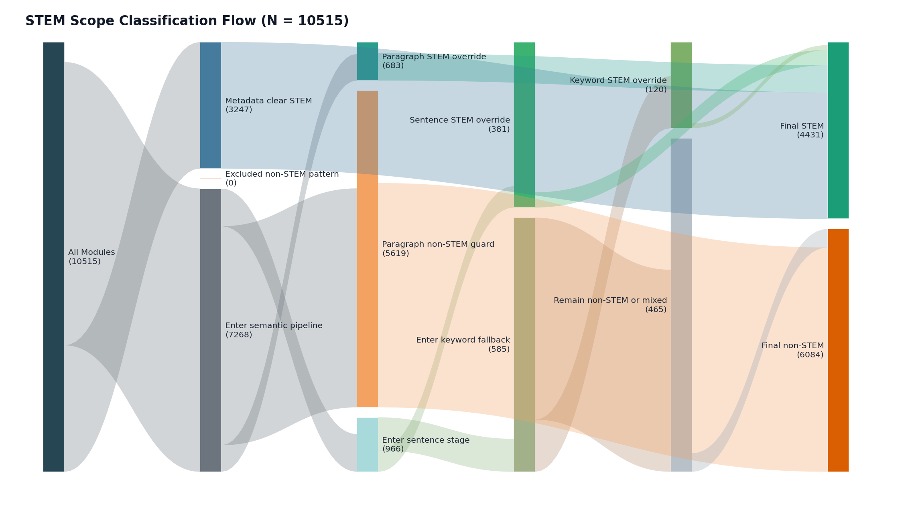

# Technical Report

## 1. Context

In recent years, concerns have emerged over declining employment outcomes among fresh graduates in Singapore. The 2025 Graduate Employment Survey (GES) reported a [decline in full-time permanent employment despite stable median salaries](https://www.straitstimes.com/singapore/parenting-education/fewer-fresh-uni-graduates-in-2025-found-full-time-work-but-pay-held-steady-survey), while surveys indicate [increasing anxiety among graduates on job prospects](https://www.channelnewsasia.com/singapore/fresh-graduates-university-job-search-cna-poll-5288556).

These trends raise important questions about the alignment between higher education and labour market demands. Current analyses rely on aggregate outcomes, lacking visibility into specific skills or curriculum components contributing to employability outcomes. While universities continue to equip students with theoretical knowledge and foundational skills, the evolving nature of industry requirements, driven by technological advancements and shifting economic conditions, may result in a mismatch between what is taught and what employers seek.

Hence, this project answers a key question: **How well are university courses preparing students for real-world jobs?** By analysing job descriptions alongside university course content, we aims to systematically evaluate the extent to which academic curricula align with current industry skill requirements, and to identify potential gaps that may contribute to graduate employment challenges.

## 2. Scope

### 2.1 Problem

**MOE’s Higher Education Policy Division (HEPD)** must ensure university curricula stay aligned with labour market needs. This problem is ongoing and high-frequency: job requirements evolve continuously, while universities update courses on slower academic cycles. HEPD therefore needs a repeatable way to compare what students are taught against what employers currently demand.

Today, this assessment is difficult because job advertisements and course descriptions are **unstructured** and **large-scale**. They are written in inconsistent language, vary by context, and change over time. The volume is also substantial, with thousands of postings and many course descriptions to review. In practice, manual reviews and periodic audits are resource-intensive and typically run on multi-year cycles, which limits HEPD’s ability to respond quickly.

The impact is tangible. If alignment is weak, graduates face poorer employment outcomes. Recent graduate employment results have shown declines in full-time employment. Students also experience greater uncertainty during job search. For **institutions**, delayed insight can lead to continued investment in low-relevance course content. For **policymakers**, lagged detection of emerging skill gaps delays interventions and reduces policy effectiveness. Without a scalable approach, HEPD risks making decisions on outdated evidence.

Data science and machine learning are appropriate as they directly address scale, variability, and timeliness. **Natural language processing** can extract and standardize skill signals from messy text; **embedding models** can place job and course content in a shared semantic space and quantify alignment using similarity scores; and **automated pipelines** can run continuously, turning a manual, periodic process into near real-time monitoring. This enables faster, more consistent, and evidence-based curriculum policy decisions.

### 2.2 Success Criteria

The project is successful if it helps HEPD and universities **assess alignment of curriculum content with employer demand**, and use this to **improve curriculum planning**. It should also produce practical employability insights by **linking courses to relevant job opportunities and associated market signals** (such as salary patterns), so students, educators, and policymakers can make better decisions.

Operationally, success means the system can process large unstructured datasets reliably and efficiently through automated workflows (cleaning, skill extraction, embedding, and matching), **reducing analysis time from manual cycles to repeatable runs**. It should also produce stable, interpretable alignment scores that reflect meaningful skill overlap while minimizing noise from irrelevant text.

### 2.3 Assumptions

Our project assumes that job advertisements are a reasonable proxy for labour market demand, and that course descriptions reasonably represent the skills students acquire. It also assumes NLP methods can recover useful skill signals despite inconsistent wording, and that semantic similarity between course and job text is a useful indicator of alignment (even if it does not fully capture skill depth or practical proficiency). Finally, it assumes data quality and coverage are sufficient, and that MOE and university stakeholders are willing and able to act on the insights generated.


## 3. Methodology

### 3.1 Technical Assumptions

This project relies on several technical assumptions.

First, job advertisements are treated as a reasonable proxy for current labour-market demand, while module descriptions are treated as a proxy for taught skills.

Second, module-job semantic similarity is interpreted as a relevance signal rather than causal evidence of employability outcomes.

Third, a shared canonical skill vocabulary can preserve meaningful cross-domain comparability between educational and labour-market text.

Fourth, grouping demand at the 3-digit SSOC level provides a suitable balance between specificity and stability for alignment analysis.

Fifth, `good_job_pct` is treated as a useful quality-weighting signal for interpreting alignment toward better entry-level opportunities, while recognising that this remains a proxy rather than a complete quality measure.

Finally, STEM robustness analysis assumes that reducing cross-domain heterogeneity provides a valid sensitivity test for whether observed alignment patterns are stable under tighter technical scope.

### 3.2 Data

#### 3.2.1 Jobs Data Cleaning

`data_cleaning_jobs_merged.ipynb` follows a standard data engineering pattern:

```mermaid
flowchart LR
    A["Ingest **22,718** raw records"] --> B["Standardise schema"]
    B --> C["Apply policy-relevant filters"]
    C --> D["Engineer labour features"]
    D --> E["Rating "Goodness" of job"]
    E --> F["Clean skills"]
    F --> G["Persist analysis-ready outputs"]
    G --> H["Run descriptive validation checks"]
```

`data_cleaning_jobs_merged.ipynb` converts 22,718 raw postings into an analysis-ready job dataset focused on **entry-level demand**. Records are first flattened into a standard schema (job metadata, text fields, salary, and SSOC codes), and HTML is removed from descriptions to reduce formatting noise.

Filtering then enforces project relevance: only fresh-graduate postings with 0-1 years experience are kept; records with missing or very short descriptions (<10 words) are dropped; and likely postgraduate/research roles are excluded using keyword rules. Employment metadata is normalised by mapping employer-provided tags into interpretable contract/work categories. Missing work type is inferred within 3-digit SSOC groups when possible, and salary fields are converted to numeric values to compute average salary. Goodness of job is then computed, based on factors including average salary, work flexibility, job stability and ease of getting the job. 

Skills are cleaned in a separate stage to balance coverage and precision: strings are normalised (case/punctuation/spacing), low-value generic labels are removed, synonymous soft-skill variants are collapsed, selected multi-word technical phrases are preserved, and near-duplicate skills within each posting are removed with fuzzy matching. To reduce sparsity, only skills appearing at least three times are retained, and postings with fewer than three cleaned skills are removed.

The final output (`jobs_cleaned.pkl`) contains **7,104 postings** (**6,448 full-time; 656 part-time**) with an average of **12.76 cleaned skills per posting**, followed by descriptive checks to validate plausibility before downstream modelling.


#### 3.2.2 University Data Cleaning

`data_cleaning_university_merged.ipynb` standardises module data from NUS (API) and NTU/SUTD (scraped outputs) into one university dataset for skill extraction and alignment analysis. Core fields (module code, title, description, department, university) are harmonised despite source-level schema differences, with NTU department codes mapped via a lookup table (`ntu_dept_mapping.xlsx`).

Text cleaning removes noise and improves comparability across institutions: descriptions are lowercased, spelling/formatting inconsistencies are normalised, HTML and invalid Unicode artefacts are stripped, and whitespace is standardised. The dataset is then filtered to undergraduate-relevant content by removing records with missing critical fields, very short descriptions, and modules flagged as postgraduate or out-of-scope faculties.

For NLP readiness, cleaned descriptions are tokenised and normalised for robust word-count and embedding-based processing. The notebook then saves a unified, consistent dataset (including provenance fields) as the source of truth for downstream skill mapping and curriculum-job matching. Final retained counts are **8,499** (NUS), **1,817** (NTU), and **199** (SUTD) modules.


#### 3.2.3 Skill Standardisation

A shared canonical framework (`canonical_skill_framework_v4.json`) standardises both module and job skills before alignment. The framework contains **89 canonical skills** and **24 excluded phrases**, with aliases, types, and notes.


This staged process improves cross-source comparability while limiting brittle phrase mismatch. `module_skill_rules.py` provides additional phrase-to-skill rules, allowed labels, and blocklists to improve consistency on the module side.


### 3.3 Experimental Design

Our baseline, experimental and STEM pipeline convert cleaned modules and jobs into comparable skill profiles, maps them into a shared canonical vocabulary, and computes module-job alignment.

#### 3.3.1 Baseline Pipeline

The baseline workflow (`src/create_test/run_baseline_pipeline.sh`) starts from two cleaned sources: course modules (`combined_courses_cleaned.pkl`) and jobs (`jobs_cleaned.pkl`).

```mermaid
flowchart LR
    A["combined_courses_cleaned.pkl"] --> C["create_test_datasets.py"]
    B["jobs_cleaned.pkl"] --> C["create_test_datasets.py"]
    C --> D["module_descriptions_test.jsonl"]
    C --> E["job_descriptions_test.jsonl"]
    F["module_skill_rules.py"] --> G["build_canonical_skill_framework.py"]
    G --> H["canonical_skill_framework_v4.json"]
    E --> I["extract_job_ssoc3_from_original.py"]
    I --> J["job_ssoc345_with_skills_from_original.jsonl"]
    D --> K["canonical_skill_mapper.py"]
    J --> K["canonical_skill_mapper.py"]
    H --> K
    K --> L["module_skills_canonical.jsonl"]
    K --> M["job_skills_canonical.jsonl"]
    L --> N["align_module_job_canonical.py"]
    M --> N
    N --> O["module_job_alignment_canonical.json"]

    classDef script fill:#dceeff,stroke:#24557a,stroke-width:1.5px,color:#102a43;
    classDef data fill:#e8f5e9,stroke:#2f6b3a,stroke-width:1.5px,color:#183a1d;

    class C,G,I,K,N,F script;
    class A,B,D,E,H,J,L,M,O data;
```



The pipeline has four key stages.

First, `create_test_datasets.py` exports analysis-ready module/job JSONL files with stable IDs (`university::code` for modules, `uuid` for jobs) and required metadata.

Second, `build_canonical_skill_framework.py` constructs a shared skill vocabulary from canonical labels, aliases, and excluded phrases; this ensures module and job text are compared in the same skill space.

Third, `canonical_skill_mapper.py` maps raw phrases to canonical skills using staged logic: normalisation, exclusion checks, exact/alias matching, then semantic fallback (`all-MiniLM-L6-v2`, cosine threshold 0.72).

Fourth, `align_module_job_canonical.py` groups jobs at SSOC-3, builds weighted job-skill profiles, and scores each module-job-group pair using coverage, weighted Jaccard, cosine similarity, and a gap penalty. We then apply a job-quality layer via `good_job_pct` and report both raw alignment and quality-weighted alignment.


#### 3.3.2 Experimental Pipeline

The experimental workflow (`src/create_test/run_experimental_pipeline.sh`) changes only one component: module-side skill extraction. Instead of notebook-derived module skills, `experimental/extract_module_skills_independent.py` extracts skills directly from descriptions using n-gram candidates, MiniLM relevance ranking, rule constraints (`module_skill_rules.py`), and canonical normalisation.

All other components (job processing, canonical framework, mapper, and alignment scorer) are kept fixed to isolate causal impact of the extractor change. This is a controlled component-level comparison, not a full pipeline redesign.

The following examples show why this variant was tested; modules can receive more technically specific skill tags under the independent extractor.

| Module | Baseline canonical skills | Experimental canonical skills | Interpretation |
|---|---|---|---|
| `Search Engine Optimization and Analytics` | `Marketing`, `Programming`, `Python`, `research skills` | `Algorithm Design`, `Data Analysis`, `Machine Learning`, `Optimization`, `Programming`, `Python`, `search engine optimization` | experimental is more technically specific |
| `Biology Laboratory` | `ecological design`, `genetic engineering`, `research skills` | `Laboratory Skills`, `Research`, `life science research`, `research lab` | experimental is more domain-faithful |
| `From DNA to Gene Therapy` | `Project Management`, `fieldwork`, `genetic engineering`, `research skills` | empty | experimental is too brittle at scale |


#### 3.3.3 STEM Robustness Pipeline

To test robustness under a tighter technical scope, we run a STEM-focused variant of the pipeline. The objective is to reduce cross-domain noise from non-technical modules and check whether alignment behaviour remains stable in a more homogeneous setting.

Module scope is determined using a **hybrid STEM classifier**:

1. Modules from predefined STEM faculties/departments are directly labelled STEM.

2. For remaining modules, we embed title + description and compare against STEM and non-STEM prototype centroids.
   - If margin is strongly positive (`>= 6%`), we classify as STEM.  
   - If strongly negative (`<= -2%`), block STEM override.

3. If the margin is inconclusive (`-2%` to `6%`), we score sentence-level margins (`±0.04`) and require both:
   - non-negative document margin, and
   - more supporting than opposing sentences (at least +1 net support).

4. If still unresolved, we apply a quantitative STEM keyword rule (`quant_min_score = 2`) with contextual safeguards (false-positive terms, non-STEM context checks, and blocklists).



This layered design prevents isolated technical words from misclassifying non-STEM modules (for example, humanities descriptions containing terms like “regression”). After STEM scoping, downstream stages remain unchanged (shared canonical framework, canonical mapping, SSOC-based alignment), so observed differences are attributable mainly to scope and extraction effects.

Apart from the STEM-specific scoping and module extraction, the `stem_test` pipeline keeps a similar downstream alignment backbone as `baseline`.


#### 3.3.4 Evaluation Metrics

We evaluate the methodology at two levels:

1. **Module-to-job-family matching quality** (does each module map to a plausible labour-demand profile?)
2. **Pipeline-level reliability** (does the method work consistently across the full dataset?)

For model selection, we primarily optimise **`top1_overlap_rate`**, while checking **`empty_modules`** and **`average_top1_score`** as guardrails. This is the most appropriate choice as our goal is not just high similarity scores, but **credible, skill-grounded matches** between modules and job families at scale.

**A. Alignment component metrics (used inside module-job scoring)**

| Metric | What it means in context | How it is calculated (intuitive) | Why it matters |
|---|---|---|---|
| `strict_overlap` | The exact shared canonical skills between a module and a job family | List the canonical skills that appear in both profiles | Makes matches explainable and helps diagnose false positives/negatives |
| `coverage_top_k` | Whether the module covers the job family’s most important skills | Take the job family’s top-demand skills and check how many are present in the module | Best signal for curriculum relevance to core labour-market demand |
| `weighted_jaccard` | Overlap quality after accounting for skill importance/frequency | Compare shared vs non-shared skill weight, not just skill counts | Captures both overlap and mismatch magnitude |
| `cosine_similarity` | Overall similarity of full skill profiles | Compare the full module and job-family skill patterns after normalisation | Useful when there is partial overlap but similar profile shape |
| `gap_score` | Missing demand from the job-family side | Measure how much high-weight job-family skill mass is absent from the module | Directly quantifies curriculum skill deficits |

**Weighting rationale for final alignment score**

The final score is a weighted blend with **heuristic, policy-facing priorities**:

- `coverage_top_k` gets the highest weight (**0.40**) because teaching the most demanded job-family skills is the primary objective.
- `weighted_jaccard` gets **0.25** to reward stronger weighted overlap and penalise broad mismatch.
- `cosine_similarity` gets **0.20** as a secondary global-similarity signal.
- `(1 - gap_score)` gets **0.15** to penalise missing important skills without over-dominating the score.

This weighting reflects the intended decision logic: **prioritise core-skill coverage first, then refine with broader similarity and explicit gap penalties**.

**B. Pipeline-level evaluation metrics (reported at dataset level)**

| Metric | Definition | Calculation | Rationale |
|---|---|---|---|
| `module_count` | Total modules evaluated | Count all modules entering alignment | Confirms analysis scope |
| `empty_modules` | Modules with no canonical skills after processing | Count modules that end with empty skill profiles | Key robustness/coverage failure signal |
| `job_group_count` | Number of job families available for matching | Count SSOC-3 groups with usable profiles | Confirms labour-market coverage |
| `top1_positive_modules` | Modules with a non-zero best match | Count modules whose best match has positive alignment | Basic viability of matching |
| `top1_overlap_modules` | Modules whose best match has explicit shared skills | Count modules whose best match has non-empty strict overlap | Credible skill-grounded linkage |
| `top1_positive_rate` | Share of modules with any viable best match | Divide `top1_positive_modules` by total modules | Dataset-level matching viability |
| `top1_overlap_rate` | Share of modules with explicit skill overlap in top match | Divide `top1_overlap_modules` by total modules | **Primary optimisation metric** |
| `average_top1_score` | Mean strength of best matches | Average the top-1 alignment score across matched modules | Indicates overall matching quality |
| `average_top1_good_job_pct` | Quality profile of best-matched job families | Average job-quality percentage of top-1 matches | Connects alignment to job-quality context |
| `average_top1_quality_weighted_alignment` | Alignment quality adjusted by job quality | Average quality-weighted top-1 alignment | Rewards alignment to better entry-level opportunities |
| `average_top3_weighted_good_job_pct` | Quality signal across top-3 matches | For each module, compute score-weighted quality across top-3, then average | Less brittle than single-match quality view |


## 4. Findings

### 4.1 Results

Table X compares the three pipelines on common dataset-level metrics.

| Metric | Baseline | Experimental | STEM Pipeline |
|---|---:|---:|---:|
| Modules evaluated | 10,507 | 10,507 | 4,431 |
| Empty modules | 136 | 2,819 | 19 |
| Non-empty modules | 10,371 | 7,688 | 4,412 |
| Top-1 overlap rate | 0.7391 | 0.5775 | 0.9998 |
| Average top-1 score | 0.0647 | 0.0410 | 0.1571 |
| Avg canonical skills per non-empty module | 4.537 | 2.419 | 7.356 |

The pattern is clear: the baseline is the strongest **general-purpose** pipeline, the experimental variant is more specific in selected cases but less robust, and the STEM pipeline is strongest **within a narrowed STEM scope**.

The baseline provides the best balance of coverage and match quality on the full module universe. It retains high usable coverage (10,371 non-empty modules out of 10,507), achieves a strong top-1 overlap rate (0.7391), and has a higher average top-1 score (0.0647) than the experimental pipeline.

From the baseline-only quality layer, top-1 matches also map to job families with moderate quality concentration (`average_top1_good_job_pct = 0.6466`), with `average_top1_quality_weighted_alignment = 0.0385` and `average_top3_weighted_good_job_pct = 0.3564`.

The experimental pipeline was a controlled test where only module-side extraction changed. It improved skill specificity for some modules (for example, more technical tags for *Search Engine Optimization and Analytics* and more domain-faithful lab skills for *Biology Laboratory*), but performance dropped at dataset level.

The largest issue is coverage loss: empty modules increase from 136 (baseline) to 2,819, with corresponding declines in top-1 overlap (0.5775) and average top-1 score (0.0410). The old report’s failure analysis shows this originates upstream in independent extraction, before canonical mapping.

Hence, despite better precision in selected examples, the method is not suitable for mainline use.

The STEM pipeline delivers very strong in-scope performance: only 19 empty modules out of 4,431, near-complete top-1 overlap (0.9998), higher average top-1 score (0.1571), and higher average canonical skills per non-empty module (7.356).  
These results are best interpreted as an in-domain robustness result under a semantically tighter dataset, not as direct superiority over full-universe pipelines.

For general deployment, we should retain the **baseline** as the primary workflow because it is the most reliable across the full dataset. The **experimental** extractor remains a targeted R&D component for selected technical contexts. The **STEM** workflow is a strong scoped extension for STEM-focused policy analysis where domain homogeneity is intentional.


### 4.2 Discussion

Our findings are most useful as a **decision-support signal** for curriculum review, not a direct measure of graduate readiness.

For HEPD, the business value is that unstructured job and course text is converted into consistent indicators that can be monitored over time. Metrics such as empty-module rate, overlap rate, and alignment score show where coverage is strong, where confidence is lower, and where manual review should be prioritised.

These metrics translate into operational value. Lower empty-module rates mean less manual fallback work. Higher overlap rates mean more modules can be mapped to plausible job clusters, improving departmental summaries and reducing blind spots. Stable outputs across runs make time-based comparisons more reliable and reduce policy risk from one-off interpretation. This addresses the core business problem by replacing infrequent, labour-intensive audits with a repeatable monitoring process.

Results should still be interpreted relatively. Absolute alignment scores are expected to be modest because a single module captures only part of a job’s full competency bundle. The practical use is to detect patterns: persistent skill gaps, weakly aligned module groups, and areas that require targeted review. Canonical skill mappings and SSOC-linked top matches provide a traceable path from source text to final scores, making results easier to audit and discuss with stakeholders. Deployability is realistic because the workflow is script-based and reproducible.

Overall, the business problem is **partially addressed**: the system is strong enough for structured monitoring and prioritisation, but not yet suitable for fully automated, high-stakes policy decisions.


### 4.3 Limitations, Biases, Ethical Considerations

Our analysis has several limitations.

Firstly, **data coverage is constrained**. The job dataset is derived from a short MyCareersFuture snapshot, which may capture temporary demand patterns rather than stable labour-market structure. Job-role filtering is rule-based (e.g. `minimum_years_experience` and keyword exclusions), which can introduce false positives and false negatives. Job skills also depend on employer-entered fields with uneven quality, potentially overrepresenting generic soft skills and undercapturing technical requirements expressed in free text. On the education side, coverage is limited to three universities and catalogue-level module descriptions, without full syllabus or assessment evidence.

Secondly, **modelling choices introduce uncertainty**. STEM scope classification combines metadata and semantic rules and may misclassify edge cases, especially for interdisciplinary modules. Canonical mapping improves consistency, but it may collapse distinctions that matter in practice or preserve distinctions that are functionally equivalent. Hence, output quality remains sensitive to taxonomy design, extraction thresholds, and mapping logic.

Thirdly, **interpretation should remain cautious**. Module-job similarity is a relevance signal, not causal evidence of programme effectiveness or graduate readiness. High alignment does not guarantee employment outcomes, and low alignment does not imply low educational value. These results should be interpreted alongside non-text evidence, including internship performance, graduate outcomes, and employer validation.

Lastly, **fairness and ethics are important**. Employer language in job ads should not be treated as objective labour-market truth. A skill-overlap framing may systematically favour domains with standardised technical vocabulary and understate strengths in humanities or interdisciplinary programmes. If used without safeguards, the framework could encourage overreaction to short-term demand and underinvestment in foundational and transferable capabilities. Human review, periodic taxonomy audits, and discipline-aware interpretation are therefore necessary before high-stakes policy use.


### 4.4 Recommendations

Our project has potential to create business value for MOE HEPD and universities. The appropriate next step is **staged deployment** rather than immediate full-scale operationalisation.

The system should first be deployed as an internal decision-support tool through a **controlled pilot** (e.g. STEM-focused or selected faculties). Expansion should proceed only if key conditions are met over repeated refresh cycles: low and stable empty-module rates, reproducible outputs, and analyst validation that sampled matches are substantively plausible and useful for policy workflow.

Next, **high-impact data constraints should be addressed before broader rollout**. Job data should be expanded beyond a one-week single-source snapshot to include **additional job portals** (e.g. LinkedIn, Careers@Gov) and a **longer time horizon**. Graduate-role labelling should move beyond simple experience filters, and job-side extraction should incorporate richer free-text signals. On the curriculum side, incorporating **fuller syllabus and assessment information (where feasible)** is likely to improve alignment quality more than further tuning of scoring weights alone.

A **governance track** should run in parallel with technical scale-up. This includes data-sharing agreements, PDPA-compliant data handling, role-based access controls, and version tracking for taxonomies and models. Fairness checks across disciplines should be integrated into regular reporting, and policy interpretation should require human review plus triangulation with external outcomes.

From a cost perspective, deployment is feasible but requires **deliberate investment** in ingestion automation, workflow orchestration, quality checks, reporting interfaces, and ongoing taxonomy maintenance. These costs are justified if the system reduces manual audit burden and improves timeliness of curriculum-risk detection. If pilot criteria are not met after planned iterations, the project should be narrowed to exploratory analytics or closed. If criteria are met, the system should be institutionalised as a recurring monitoring capability that informs, but does not replace, expert policy judgment.


## 5. Appendix: Suggested Figures and Tables

- Add a planning section for visuals if the final report will include them.
- Suggested visuals:
  - end-to-end pipeline diagram
  - job cleaning attrition table or waterfall chart
  - university data source summary table
  - canonical skill framework diagram
  - baseline versus experimental comparison table
  - STEM versus general pipeline comparison table
  - final alignment summary chart
