```mermaid
flowchart LR
    A["combined_courses_cleaned.pkl"] --> C["create_test_datasets.py"]
    B["jobs_cleaned.pkl"] --> C["create_test_datasets.py"]
    C --> D["module_descriptions_test.jsonl"]
    C --> E["job_descriptions_test.jsonl"]
    F["module_skill_rules.py"] --> G["build_canonical_skill_framework.py"]
    G --> H["canonical_skill_framework_v4.json"]
    E --> I["extract_job_ssoc3_from_original.py"]
    I --> J["job_ssoc345_with_skills_from_original.jsonl"]
    D --> K["canonical_skill_mapper.py"]
    J --> K["canonical_skill_mapper.py"]
    H --> K
    K --> L["module_skills_canonical.jsonl"]
    K --> M["job_skills_canonical.jsonl"]
    L --> N["align_module_job_canonical.py"]
    M --> N
    N --> O["module_job_alignment_canonical.json"]

    classDef script fill:#dceeff,stroke:#24557a,stroke-width:1.5px,color:#102a43;
    classDef data fill:#e8f5e9,stroke:#2f6b3a,stroke-width:1.5px,color:#183a1d;

    class C,G,I,K,N,F script;
    class A,B,D,E,H,J,L,M,O data;
```

# Technical Report: 

## 1. Context and Objective

In recent years, concerns have emerged over declining employment outcomes among fresh graduates in Singapore. The 2025 Graduate Employment Survey (GES) reported a decline in full-time permanent employment despite stable median salaries (The Straits Times, 2025), while surveys indicate increasing anxiety among graduates on job prospects (Channel NewsAsia, 2025).

These trends raise important questions about the alignment between higher education and labour market demands. Current analyses rely on aggregate outcomes, lacking visibility into specific skills or curriculum components contributing to employability outcomes. While universities continue to equip students with theoretical knowledge and foundational skills, the evolving nature of industry requirements, driven by technological advancements and shifting economic conditions, may result in a mismatch between what is taught and what employers seek.

Hence, this project answers a key question: How well are university courses preparing students for real-world jobs? By analysing job descriptions alongside university course content, we aims to systematically evaluate the extent to which academic curricula align with current industry skill requirements, and to identify potential gaps that may contribute to graduate employment challenges.

### 1.1 Project Scope

#### 1.1.1 Problem definition 
MOE’s Higher Education Policy Division (HEPD) faces the ongoing challenge of ensuring that university curricula remain aligned with labour market demands. As the body responsible for higher education policy and quality assurance, HEPD must regularly assess whether graduates possess the skills required by employers.
However, this task is inherently complex due to the nature of the data involved. Job advertisements and course descriptions are large-scale, unstructured, and continuously evolving sources of information. Thousands of job postings are generated regularly, with skills described using varied, inconsistent, and context-dependent language. Similarly, course descriptions differ across institutions in structure, terminology, and level of detail.
This problem occurs continuously as labour market demands shift rapidly due to technological advancements and industry changes. In the absence of an automated system, HEPD relies on manual reviews or periodic audits conducted over multi-year cycles. These approaches are resource-intensive and unable to keep pace with real-time changes, increasing the risk that curriculum evaluations are based on outdated or incomplete information.

#### 1.1.2 Impact and Significance 
The lack of a scalable and systematic approach to assessing curriculum–labour market alignment has several key consequences:
Graduate employability challenges: The 2025 Graduate Employment Survey (GES) reports a decline in full-time employment among fresh graduates, suggesting potential mismatches between acquired skills and employer expectations (The Straits Times, 2025).
Increased job search anxiety: Graduates report heightened uncertainty and stress in securing employment, reflecting concerns about their preparedness for the job market (Channel NewsAsia, 2025).
Inefficient curriculum planning: Universities may continue offering courses that are not closely aligned with industry needs, leading to suboptimal allocation of educational resources.
Delayed policy response: Without timely insights, MOE may take years to identify emerging skill gaps, limiting its ability to respond proactively.
Scalability limitations: Manually analysing thousands of job postings and course descriptions is impractical, making continuous monitoring infeasible.
Collectively, these issues weaken the ability of the higher education system to produce graduates who are well-prepared for an evolving workforce.

#### 1.1.3 Why Data Science / Machine Learning is Appropriate
Data science and machine learning provide a suitable solution due to their ability to process large-scale, unstructured, and dynamic data.
First, Natural Language Processing (NLP) techniques enable the extraction and standardisation of skill-related information from both job advertisements and course descriptions, allowing meaningful comparison despite differences in wording.
Second, embedding-based models can represent both datasets within a shared semantic space, where similarity measures (e.g., cosine similarity) quantify the alignment between courses and job requirements. This transforms qualitative text into measurable indicators.
Finally, automated data pipelines enable continuous and scalable analysis, allowing MOE to monitor labour market trends in near real-time rather than relying on infrequent manual reviews. This improves both the speed and reliability of insights, supporting more responsive and data-driven policy decisions.
Overall, data science and machine learning directly address the challenges of scale, variability, and timeliness, making them well-suited for evaluating curriculum relevance in a rapidly changing labour market.

### 1.2 Success Criteria

#### Business Goals
If our project is successful, it can improve alignment between university curricula and labour market demand. The project enables stakeholders (e.g., MOE, universities) to identify gaps between skills taught in courses and skills required in job advertisements. Success is achieved if the system can consistently highlight high- and low-alignment courses, supporting data-driven curriculum improvements.

Another success outcome is enhancing graduate employability insights. By linking courses to relevant job opportunities and associated salary signals, the system provides actionable insights into which courses are most aligned with industry needs. Success is reflected in the ability to generate meaningful rankings or recommendations that inform students, educators, and policymakers.

#### Operational Goals 
Scalable and efficient processing of large unstructured datasets is another success outcome. The system should be able to process thousands of job postings and course descriptions efficiently using automated pipelines (e.g., text cleaning, skill extraction, embeddings). Success is achieved if the pipeline runs reliably within a reasonable time (e.g., minutes instead of manual analysis).

Accurate and consistent skill extraction and matching should also be achieved. The system should produce reliable representations of skills from both job and course data. Success is indicated by consistent alignment scores that reflect meaningful overlaps between courses and jobs, avoiding noise from irrelevant or low-quality skill data.

### 1.3 Assumptions

This project is based on several key assumptions that influence its feasibility and the validity of its outputs.

First, it is assumed that job advertisements provide a reliable proxy for labour market demand. While job postings reflect employer requirements, they may not always fully capture actual job responsibilities or may include inflated or generic skill requirements. 
Second, the analysis assumes that university course descriptions accurately represent the skills and knowledge acquired by students. In practice, actual learning outcomes may vary depending on teaching methods, assessments, and informal learning experiences.

Third, the project assumes that NLP techniques can effectively extract meaningful skill signals from unstructured text. However, some skills may be implicit, context-dependent, or described inconsistently, which could affect extraction accuracy.

Fourth, it is assumed that semantic similarity between course content and job descriptions is a valid indicator of real-world alignment. While embedding models capture textual similarity, they may not fully reflect the depth or practical applicability of skills.

Finally, it is assumed that sufficient and representative data is available, and that stakeholders (e.g., MOE and universities) are able to act on the insights generated. Without adequate data quality or institutional adoption, the system’s impact would be limited.

## 2. Data and Cleaning

### 2.1 Jobs Data Cleaning

#### 2.1.1 Notebook Workflow

Methodologically, the notebook follows a standard data engineering pattern:

1. Ingest raw semi-structured JSON records.
2. Standardise nested fields into tabular columns.
3. Filter for the target population of interest.
4. Engineer interpretable features.
5. Clean and regularise skills.
6. Persist analysis-ready outputs.
7. Run descriptive analyses to validate whether the cleaned dataset reflects plausible labour-market patterns.

This sequence separates structural cleaning from analytical interpretation while keeping both in the same artifact for transparency.

#### 2.1.2 Project-Wide Pipeline Overview

- Add a short end-to-end overview of the full project workflow:
  - raw job and module data acquisition
  - scraper outputs
  - notebook-based cleaning
  - downstream dataset construction
  - canonical skill mapping
  - module-job alignment
- Clarify that the report should ultimately cover the full project system, not only the jobs notebook.
- State that the notebook-cleaned PKL files are now the source of truth for downstream workflows.
- Mention the standardized shell-script entrypoints for the supported pipelines.

#### 2.1.3 Data Collection and Ingestion

The loader searches `../../data` recursively for files whose names begin with `MCF-`, falling back to a `job` subdirectory only if needed. This is a robust engineering decision because it prioritises the intended project data while remaining resilient to folder reorganisation. During execution, the notebook discovered **22,718 raw JSON files** and loaded **22,718 job rows**.

Each record is flattened into a structured row with fields such as:

- `uuid`
- `title`
- `description`
- `minimum_years_experience`
- `skills`
- `employment_types`
- `position_levels`
- `categories`
- `salary_minimum`, `salary_maximum`
- posting and expiry dates
- `ssoc_code` and `ssoc_version`

The notebook also strips HTML from descriptions using `BeautifulSoup`, which is important because job descriptions are often stored as HTML fragments rather than plain text. This reduces noise before text-based filtering and makes length checks more meaningful.

#### 2.1.4 Targeted Cleaning for Graduate-Relevant Roles

The first major cleaning stage aligns the dataset to the project objective: identifying labour demand relevant to undergraduates and recent graduates.

The pipeline applies the following filters:

- Keep only postings with `minimum_years_experience` in `{0, 1}`.
- Drop rows missing title or description.
- Remove descriptions with fewer than 10 words.
- Remove internships using title, description, and employment-type signals.
- Remove likely postgraduate roles using title cues such as "research fellow" or "assistant professor".
- Remove postings whose descriptions strongly indicate postgraduate qualifications, including PhD or Master's requirements.
- Deduplicate records using the pair `(title, description)`.

The observed row counts show the effect of each stage:

| Stage | Rows Remaining |
|---|---:|
| Raw loaded postings | 22,718 |
| After experience filter | 9,477 |
| After description filter | 9,476 |
| After undergraduate-only filter | 8,834 |
| After deduplication | 7,115 |
| After skill thresholding | 7,104 |

These filters demonstrate robustness in two ways. First, they address known data quality issues such as sparsity and duplication. Second, they encode domain logic rather than relying on generic preprocessing. In a public-sector context, that matters because the distinction between internship, graduate, and postgraduate pipelines is policy-relevant: interventions for undergraduate curriculum design should not be distorted by jobs intended for researchers or late-stage professionals.

#### 2.1.5 Employment Type, Salary, and Imputation Logic

The notebook derives `contract_type` and `work_type` from employer-provided `employment_types`, mapping values into interpretable categories such as `Permanent`, `Contract`, `Temporary`, `Freelance`, `Full Time`, and `Part Time`.

If both contract type and work type are unknown, the row is removed. This avoids carrying forward records with insufficient labour-market signal.

The notebook then converts salary fields to numeric format and computes `avg_salary` as the rounded mean of minimum and maximum salary. For work type, the notebook implements a two-step imputation strategy:

- First, infer likely work type using the modal observed work type within the same 3-digit SSOC group.
- If SSOC-based inference is unavailable, fall back to a salary threshold derived from the median salaries of known full-time and part-time jobs.

It compromises between practical utility and interpretability. It is more principled than filling all missing work types with the dominant class, because it uses occupational structure first and only uses salary as a weaker fallback. In public-sector analytics, such hierarchy-based imputation is preferable because it better preserves real labour-market structure.

After cleaning, the final job dataset contains:

- **7,104 rows**
- **6,448 full-time postings**
- **656 part-time postings**
- Contract types dominated by `Unknown` (3,133) and `Permanent` (2,781), followed by `Contract` (804), `Temporary` (331), and `Freelance` (55)

The large `Unknown` contract-type share is itself an important analytical finding: it reflects incomplete source metadata and should be acknowledged in any downstream interpretation.

#### 2.1.6 Skill Normalisation and Frequency Filtering

The skill cleaning process has several stages:

1. Lowercase and trim raw skills.
2. Save raw skill frequencies to Excel for auditability.
3. Normalise punctuation and spacing.
4. Remove explicitly low-value labels such as `team player`, `able to work independently`, and `physically fit`.
5. Collapse variants of common soft skills into shared canonical forms, such as mapping phrases containing "communication" to `communication`.
6. Protect selected exact multi-word skills such as `project management` and `data management` from over-collapsing.
7. Remove within-row near-duplicates using fuzzy matching (`SequenceMatcher`).
8. Keep only skills that appear at least three times across the dataset.
9. Remove jobs with fewer than three cleaned skills.

This design balances precision and recall. If the notebook kept every raw employer phrase, the analysis would be overwhelmed by lexical variation and boilerplate. If it over-normalised aggressively, it would erase meaningful distinctions between technical competencies. The use of exact-keep exceptions and fuzzy deduplication shows good practical understanding of this trade-off.

The final distribution of skill counts is plausible for job postings:

- Mean number of skills per posting: **12.76**
- Median: **13**
- Interquartile range: **10 to 15**
- Minimum retained: **3**
- Maximum retained: **20**

The notebook also exports raw and cleaned skill-frequency tables to Excel, which is valuable for stakeholder review. Non-technical reviewers can inspect the vocabulary and challenge cleaning rules if necessary, making the process more governable.

#### 2.1.7 Evaluating Goodness of Job 
**to be added back after section is restored in notebook!!!**

#### 2.1.8 Output Structure and Reusability

The cleaned dataset is saved as `data/cleaned_data/jobs_cleaned.pkl`. Before saving, the notebook drops intermediate helper columns and reorders the final schema so downstream consumers receive a compact, consistent table.

This is good execution practice. Instead of passing along every temporary artifact created during cleaning, the notebook separates internal processing columns from production-facing outputs. That makes later analysis cleaner and reduces accidental dependency on unstable intermediate fields.

#### 2.1.9 Descriptive Validation and Exploratory Analysis

The second half of the notebook performs descriptive analysis on the cleaned data. This is not merely exploratory; it acts as a validation layer. If the top titles, skill distributions, and data-role patterns were obviously implausible, that would signal a problem in the cleaning pipeline.

Examples from the cleaned dataset include:

- Most common entry-level titles: `warehouse assistant` (31), `admin assistant` (24), `administrative assistant` (20), `sales executive` (19), `accounts assistant` (19)
- Most common skills overall: `Team Player` (2,857), `Customer Service` (2,114), `Interpersonal Skills` (2,059), `Communication Skills` (1,718), `Microsoft Office` (1,677)
- Titles with the widest skill range include `business development executive` (110 unique skills) and `marketing executive` (99 unique skills)

The notebook also isolates a subset of data-related roles using keyword matching. This subset contains **29 postings**, with top skills including `SQL` (14), `Data Analysis` (12), `Python` (12), `Business Analysis` (10), and `Business Requirements` (10). Median salary in this subset is **5,000**, with most postings marked as full-time.

These summaries directly support the broader project objective. They show what employers actually ask for and create a bridge to course-side skill extraction. For a university or public-sector workforce unit, this is the dataset that can later be matched against curriculum content to identify alignment gaps.

### 2.2 University Data Cleaning

#### 2.2.1 University Course Cleaning Methodology
The notebook follows a structured data engineering workflow to transform raw, semi-structured course data into an analysis-ready dataset. It begins by ingesting module data from multiple universities and standardising heterogeneous schemas into a unified tabular format. Textual fields such as titles, descriptions, and departments are cleaned and normalised, after which the dataset is filtered to retain undergraduate-relevant modules. Noisy or low-quality records are removed, and the cleaned text is prepared for downstream NLP tasks such as skill extraction. The final dataset is persisted as a structured output, with validation checks performed to ensure plausibility. This workflow separates data preparation from analysis while maintaining transparency within a single notebook.

#### 2.2.2 Project-Wide Pipeline Overview
At a system level, this notebook forms part of a broader end-to-end pipeline. The process spans raw module data acquisition (from NUS, NTU, and SUTD), preprocessing and scraping, notebook-based cleaning, and construction of a unified dataset. This dataset feeds into skill extraction and canonical skill mapping, which are then aligned with job-side skill demand for downstream analytics such as curriculum–labour market comparison. The cleaned dataset serves as the source of truth for all subsequent workflows, ensuring consistency across the project.

#### 2.2.3 Data Collection and Ingestion
Module data is loaded from multiple sources and consolidated into a unified structure despite differences in schemas and formatting. NUS data is obtained via API, while NTU and SUTD data are sourced from scraper outputs, with NTU department codes mapped to full names using an external lookup table. Key fields—module code, title, description, and department—are extracted and standardised, and a university column is added to preserve provenance.

#### 2.2.4 Text Cleaning and Normalisation
Given the inconsistency of module descriptions, extensive text cleaning is applied. This includes lowercasing, spelling standardisation, HTML removal using BeautifulSoup, elimination of invalid Unicode characters, and whitespace normalisation. These steps ensure that textual data reflects meaningful content rather than formatting artefacts, which is critical for downstream NLP tasks.

#### 2.2.5 Targeted Filtering for Undergraduate Modules
To align with project objectives, the dataset is filtered to retain only undergraduate-relevant modules. Modules with very short descriptions are removed, along with those from irrelevant faculties and postgraduate programmes identified through title and description cues. Rows with missing essential fields are also excluded. This ensures that the dataset reflects curriculum content relevant to entry-level job demand.

#### 2.2.6 Preparation for Skill Extraction
The cleaned dataset is further processed for NLP-based skill extraction. Descriptions are tokenised into manageable units, word counts are computed robustly, and text is normalised to reduce variation. This preprocessing ensures compatibility with embedding-based models such as MiniLM, preserving semantic signals while minimising noise.

#### 2.2.7 Schema Standardisation Across Universities
Finally, the notebook harmonises data across universities by standardising column names, department representations, and text formats. The dataset adopts a consistent schema (code, title, department, description, university, and skill-related fields) and is saved as a .pkl file. Intermediate artifacts are removed, producing a compact, stable dataset suitable for downstream analysis.

After cleaning, the final university dataset contains:

- **'NUS': 8499 rows of modules**
- **'NTU': 1817 rows of modules**
- **'SUTD': 199 rows of module**

## 3. General Pipeline

### 3.1 Downstream Baseline Pipeline

The main workflow lives in `src/create_test/` and starts from `data/cleaned_data/combined_courses_cleaned.pkl` and `data/cleaned_data/jobs_cleaned.pkl`, which are the source of truth for downstream analysis. It converts cleaned modules and jobs into comparable skill profiles, maps them into a shared canonical vocabulary, and computes module-job alignment. The full workflow runs via `bash src/create_test/run_baseline_pipeline.sh`.

#### 3.1.1 Pipeline Inputs and Export Layer

`create_test_datasets.py` exports downstream JSON/JSONL files from the PKLs. It uses `university::code` as module identity and `uuid` as job identity, applies a final description-length filter, and preserves module skills, department metadata, SSOC fields, salary, cleaned job skills, and the binary field `is_good_job`. In full mode it produced **10,507 module rows** and **7,104 job rows**.

#### 3.1.2 Canonical Skill Framework Construction

`build_canonical_skill_framework.py` builds the shared vocabulary used on both sides. `data/reference/canonical_skill_framework_v4.json` stores canonical labels, skill types, aliases, notes, and excluded phrases. The current framework contains **89 canonical skills** and **24 excluded phrases**. This step is necessary because direct phrase overlap is too brittle for module and job text.

#### 3.1.3 Role of `module_skill_rules.py`

`module_skill_rules.py` defines the module-side skill vocabulary. It was built by reviewing recurring module-description phrases, merging lexical variants under canonical skills, and filtering phrases that were too broad, academic, or pedagogical to function as occupational skills. The file contains phrase-to-skill rules, allowed canonical labels, evidence constraints, and blocklists. The baseline pipeline uses these rules to build the framework; the experimental and STEM pipelines reuse them during module-skill extraction.

#### 3.1.4 Job-Side SSOC Enrichment

`extract_job_ssoc3_from_original.py` converts cleaned jobs into SSOC-indexed labour-demand rows. It parses each raw SSOC field into 5-digit, 4-digit, and 3-digit codes, looks up titles from `ssoc2020.xlsx`, and writes flattened rows with SSOC hierarchy and deduplicated job skills. It also propagates `is_good_job` and computes a group-level job-quality statistic for each 3-digit SSOC bucket:

`good_job_pct = (number of jobs with is_good_job = 1 in SSOC group) / (total jobs in SSOC group)`

`good_job_pct` is stored on a `0` to `1` scale. On the full baseline run, all **7,104** job rows were preserved.

#### 3.1.5 Canonical Mapping

`canonical_skill_mapper.py` maps raw phrases into the shared framework for both modules and jobs. Each phrase is normalized, checked against excluded phrases, matched exactly against aliases where possible, and otherwise mapped semantically with `sentence-transformers/all-MiniLM-L6-v2`. The semantic fallback uses a cosine-similarity threshold of **0.72**; phrases below the threshold remain unmapped. The mapper writes row-level canonical skill lists and phrase-level mapping details. On the full baseline run, **10,507** module rows and **7,104** job rows were canonicalized.

#### 3.1.6 Alignment Logic

`align_module_job_canonical.py` compares each module against grouped job demand in canonical skill space. Jobs are grouped at the **3-digit SSOC level**, giving **119 job groups**. Each SSOC group is represented by a weighted canonical skill profile. Each module is then scored against every profile using top-`k` coverage, weighted Jaccard overlap, cosine similarity, and a gap score for missing high-weight job skills. These are combined into:

`alignment_score = 0.4 * coverage + 0.25 * weighted_jaccard + 0.2 * cosine_similarity + 0.15 * (1 - gap_score)`

We then add a job-quality layer. Each matched SSOC group carries `good_job_pct`, and each module-to-group match receives:

`quality_weighted_alignment_score = alignment_score * good_job_pct`

To reduce dependence on a single match, we also compute:

`top3_weighted_good_job_pct = sum(alignment_score_i * good_job_pct_i) / sum(alignment_score_i)` for the top three matches.

The denominator converts the weighted sum into a weighted average, so the result stays on the same `0` to `1` scale as `good_job_pct`. The script also aggregates module-level results by department.

On the full baseline rerun, the results were `module_count = 10,507`, `empty_modules = 136`, `job_group_count = 119`, `top1_overlap_rate = 0.7391`, `average_top1_score = 0.0647`, `average_top1_good_job_pct = 0.6466`, `average_top1_quality_weighted_alignment = 0.0385`, and `average_top3_weighted_good_job_pct = 0.3564`. These additions distinguish alignment to job demand in general from alignment to demand concentrated in better-quality entry-level roles.

Dataset-level metrics are defined as follows. `module_count` is the number of evaluated modules. `empty_modules` is the number of modules with an empty canonical skill list. `job_group_count` is the number of SSOC groups with at least one canonical job-skill profile. `top1_positive_modules` counts modules whose top-ranked SSOC match has `alignment_score > 0`, so `top1_positive_rate = top1_positive_modules / module_count`. `top1_overlap_modules` counts modules whose top-ranked SSOC match has `strict_overlap_count > 0`, so `top1_overlap_rate = top1_overlap_modules / module_count`. `average_top1_score` is:

`average_top1_score = sum(top1_alignment_score_m) / N`

where `N` is the number of modules with at least one top match. The job-quality summaries are:

`average_top1_good_job_pct = sum(top1_good_job_pct_m) / N`

`average_top1_quality_weighted_alignment = sum(top1_quality_weighted_alignment_score_m) / N`

`average_top3_weighted_good_job_pct = sum(top3_weighted_good_job_pct_m) / N`

Department-level results average the same module-level quantities within each `(source, department)` bucket. For department `d`:

`department_average_top1_score_d = sum(top1_alignment_score_m for m in d) / M_d^*`

where `M_d^*` is the number of modules in `d` with at least one top match. The same form is used for department-level `average_top1_good_job_pct`, `average_top1_quality_weighted_alignment`, and `average_top3_weighted_good_job_pct`.

### 3.2 Experimental Comparison

The experimental workflow lives in `src/create_test/experimental/` and runs via `bash src/create_test/run_experimental_pipeline.sh`. It changes one component only: module-side skill extraction. The baseline uses notebook-derived module skills; the experimental path replaces them with `experimental/extract_module_skills_independent.py`. The job-side pipeline, SSOC enrichment, canonical framework, and alignment logic remain fixed.

#### 3.2.2 Independent Module Skill Extraction

The independent extractor reads the same module descriptions but derives skills directly from text. It generates candidate phrases with an n-gram vectorizer, embeds descriptions and candidate phrases with `all-MiniLM-L6-v2`, ranks candidates by semantic relevance, applies rule-based matches from `module_skill_rules.py`, filters broad academic phrases, and normalizes the survivors into the same canonical skill space. We tested it because some baseline outputs were too generic. For example, `Search Engine Optimization and Analytics` looked marketing-heavy under the baseline but yielded `search engine optimization`, `Data Analysis`, `Machine Learning`, `Optimization`, and `Algorithm Design` under the independent extractor, while `Biology Laboratory` produced more domain-faithful laboratory skills.

#### 3.2.3 Experimental Results and Failure Mode

Although the independent extractor improved some technical examples, it performed much worse at dataset level. On the same **10,507** modules, the baseline left **136** empty modules while the experimental pipeline left **2,819**. The baseline achieved **0.7391** top-1 overlap and **0.0647** average top-1 score, compared with **0.5775** and **0.0410** for the experimental pipeline. Because the experimental path reuses the same SSOC enrichment, canonical framework, and job-quality-aware alignment logic, this remains a controlled comparison. The key failure occurs upstream of canonical mapping: rows that are empty in `module_skills_canonical_independent.jsonl` are already empty in `module_descriptions_test_with_skills_independent.jsonl`.

Table 1 summarizes the baseline-versus-experimental comparison on the full dataset.

| Metric | Baseline | Experimental |
|---|---:|---:|
| Modules evaluated | 10,507 | 10,507 |
| Empty modules | 136 | 2,819 |
| Non-empty modules | 10,371 | 7,688 |
| Top-1 overlap rate | 0.7391 | 0.5775 |
| Average top-1 score | 0.0647 | 0.0410 |
| Avg canonical skills per non-empty module | 4.537 | 2.419 |

Here, `non-empty modules = module_count - empty_modules`. `Top-1 overlap rate = top1_overlap_modules / module_count`, where `top1_overlap_modules` counts modules whose best-matching job group contains at least one overlapping canonical skill. `Average top-1 score = sum(top1_alignment_score_m) / N`, where `N` is the number of modules with at least one top match. `Avg canonical skills per non-empty module = (sum of canonical skill counts across non-empty modules) / (number of non-empty modules)`. The table shows that the baseline preserves more module-side signal, produces overlap for more modules, and yields stronger best-match alignments.

Table 2 shows representative module-level examples. These examples explain both why the independent extractor was worth testing and why it was not retained as the final model.

| Module | Baseline canonical skills | Experimental canonical skills | Interpretation |
|---|---|---|---|
| `Search Engine Optimization and Analytics` | `Marketing`, `Programming`, `Python`, `research skills` | `Algorithm Design`, `Data Analysis`, `Machine Learning`, `Optimization`, `Programming`, `Python`, `search engine optimization` | experimental is more technically specific |
| `Biology Laboratory` | `ecological design`, `genetic engineering`, `research skills` | `Laboratory Skills`, `Research`, `life science research`, `research lab` | experimental is more domain-faithful |
| `From DNA to Gene Therapy` | `Project Management`, `fieldwork`, `genetic engineering`, `research skills` | empty | experimental is too brittle at scale |

#### 3.2.4 Final Decision from the Comparison

We therefore kept the baseline pipeline as the main general workflow. The independent extractor could be more accurate on some technical modules, but its coverage loss was too large for full-dataset reporting. It was more specific when it worked, but too brittle for the main analysis. This result motivated the STEM robustness check.

## 4. STEM Robustness Analysis

We introduced a STEM-focused test to reduce cross-domain noise in module-job matching. In the full module universe, many modules are intentionally non-technical or mixed-context, which can dilute technical-skill signals and make alignment scores harder to interpret for workforce-oriented technical roles. By scoping to STEM, we test whether alignment patterns remain consistent under a more technically coherent module set, and to check for robustness and sensitivity.

### 4.1 STEM Classification and Pipeline

We classify modules into STEM and non-STEM using a hybrid method that combines university-specific metadata classification with semantic text understanding at the paragraph, sentence and keyword levels. Firstly, we mapped modules offered by each university’s STEM-focused departments/faculties as STEM.

For all other modules, we ran an **embedding-based paragraph classifier**, considering the semantic meaning of the module title and description. We used `sentence-transformers` to compare module embeddings with manually constructed STEM and non-STEM prototype centroid texts. The model calculated `stem_similarity`, `non_stem_similarity`, and `margin = stem_similarity - non_stem_similarity`. If `margin` is strongly negative (`<= -2%`, suggesting non-STEM dominates), we block the STEM override. For strongly positive margin (`>= 6%`, suggesting STEM dominates), we classify as a STEM module. This prevents isolated STEM keywords influencing clearly non-STEM contexts. For example, NUS EN4229 Autotheory and Contemporary Autofiction is a non-STEM module, but has the word "regression" in the sentence "Does it signal a **regression** to the Self/Subject as already critiqued by theory in the 1980s?". Hence, we need to consider the description's meaning for a robust classification.

For non-decisive paragraph semantics (`-2% < margin < 6%`), we evaluate **sentence-level semantic scoring** as a tie-breaker. We compare each sentence’s STEM vs non-STEM similarity margin and count supporting versus opposing sentences using a fixed margin threshold (`±0.04`). We then apply a STEM override only if the overall document margin is non-negative and supporting evidence exceeds opposing evidence by at least one sentence (`support_count - oppose_count >= 1`).

If semantic overrides still do not trigger, we apply a final keyword fallback (`quant_min_score = 2`) with contextual safeguards (false positives, quantitative-term blocklists, non-STEM context checks).

Apart from the STEM-specific scoping and module extraction, the `stem_test` pipeline keeps the same downstream alignment backbone as `create_test` **[include a hyperlink!!!!]** (shared canonical framework, canonical mapper, and SSOC-based alignment).

### 4.2 Results

The STEM-specific dataset has **4,431 modules** and **19** empty modules, achieving a **top-1 overlap rate of 0.9998** and an **average top-1 score of 0.1571**, compared with **0.5775** and **0.0410** respectively for the experimental pipeline.

Table 3 summarizes the results for the STEM dataset.

| Metric | Experimental | STEM Pipeline |
|---|---:|---:|
| Modules evaluated | 10,507 | 4,431 |
| Empty modules | 2,819 | 19 |
| Non-empty modules | 7,688 | 4,412 |
| Top-1 overlap rate | 0.5775 | 0.9998 |
| Average top-1 score | 0.0410 | 0.1571 |
| Avg canonical skills per non-empty module | 2.419 | 7.356 |

The STEM pipeline appears more robust because it preserves substantially more module-side skill signal, which directly improves downstream alignment quality.

Having only 19 empty modules and a higher best-match strength comes from rules better matched to language patterns in technical module descriptions. This allows for more canonical skills per module, causing a higher probability of overlap with job-group skill profiles. Hence, denser and more accurate canonical skill representations produce stronger best-match alignments. The gain is therefore best interpreted as strong in-domain robustness: the STEM pipeline’s assumptions fit the STEM data distribution much better than the broader experimental setup.

## 5. Findings and Implications

**Talk about the low alignment scores**

### 5.1 Robustness

The notebook performs strongly on robustness.

- It handles nested, inconsistent JSON structures through explicit extraction functions rather than ad hoc one-off parsing.
- It accounts for multiple forms of data quality problems: HTML contamination, missing values, duplication, noisy skill labels, weak descriptions, and unknown employment metadata.
- It includes a meaningful imputation strategy for work type instead of silently discarding all partially incomplete records.
- It creates auditable artifacts, including Excel exports for raw and cleaned skill frequencies.

From a public-sector perspective, the strongest robustness feature is its domain-aware filtering. The notebook does not treat all job postings as equally relevant. It explicitly models the difference between fresh-graduate opportunities and other labour-market segments. That is essential when outputs may influence curriculum review or manpower policy discussions.

### 5.2 Execution

There are, however, still limitations:

These do not undermine the core cleaning pipeline, but they are important if the notebook is intended to serve as a polished production artifact.

- Add a subsection evaluating execution for the full project, not only the jobs notebook:
  - code organisation
  - reproducibility
  - readability
  - documentation
  - pipeline standardisation
- Mention the creation of shell shortcuts and clearer folder structure.
- Mention which parts of the project are now officially supported versus legacy.
- Explain how the final repository design improves maintainability and handoff.

### 5.3 Communication

- Add an explicit communication subsection aligned with the rubric.
- Evaluate:
  - whether the outputs are interpretable
  - whether the pipeline is understandable to a new user
  - whether the README and technical report are clear enough for both technical and non-technical readers
- Reference visual aids or propose visual aids that should appear in the report:
  - pipeline diagram
  - data attrition chart
  - alignment summary table
  - baseline vs experimental comparison table

### 5.4 Project Findings

- Add the actual end-to-end findings of the project here.
- Suggested points to include:
  - what the baseline alignment results suggest
  - what types of modules align well with job demand
  - where likely skill gaps appear
  - what the STEM-focused analysis shows
  - whether the experimental extractor materially changes the results
- Translate these findings into stakeholder-relevant takeaways:
  - curriculum review
  - employability programming
  - areas requiring deeper manual validation

### 5.5 Policy and Stakeholder Implications

- Add a subsection that connects findings to public-sector decision-making.
- Explain how ministries, universities, and workforce agencies could use the outputs.
- Clarify what decisions the project can support and what decisions it cannot support on its own.
- Note that the outputs are best treated as evidence for prioritisation and review, not automatic policy prescriptions.

## 6. Limitations and Future Work

### 6.1 Limitations, Biases, and Ethical Considerations

Our **jobs data** is limited in scope and timeframe. We only used job descriptions from **MyCareersFuture** over **one week**. Hence, our findings may be limited in relevance; changes in labour-market trends over time may reduce comparability if the framework is not periodically refreshed.

Additionally, the graduate filter is rule-based. Using `minimum_years_experience` in `{0,1}` is practical, but employers may wronglyindicate the filter wrongly graduate-suitable jobs may require 2 years, while some 0-1 year roles may still be unsuitable for typical undergraduates. Besides, human errors from employers in wrongly selecting 0-1 year roles may exist.

Also, excluding postgraduate roles rely on keyword patterns in titles and descriptions. While this improves precision, it may generate false postiives and false negatives.

Our skill extraction depends on employer-supplied structured skill fields. Employers vary widely in how carefully they populate these fields. Hence, common soft skills may be overrepresented, while some technical competencies may be missing from the structured list even when present in the description text.

The data-role subset is small at 29 postings. It is useful for illustration, but not yet strong enough for high-confidence sectoral conclusions.

For **module descriptions**, we focused on three universities as these datasets were most accessible. We extracted skills purely based on generic module descriptions, which may not fully capture teaching quality, learning outcomes or pedagogical depth. Additionally, our STEM scope classification is rule-based and inherits the limitations of department-level labeling.

Canonical skill mapping introduces its own abstraction layer, which may merge distinct competencies or preserve distinctions that are not meaningful to employers.

Module-job alignment scores are similarity-based and should not be interpreted as causal measures of programme effectiveness.

**Is this relevant?:** The notebook supports public-sector analysis but does not by itself resolve fairness concerns. For example, if certain industries systematically omit salary data or structured skills, the cleaned dataset may underrepresent them in downstream comparisons. Policymakers should treat the outputs as directional evidence rather than ground truth.

Ethical considerations to add:

- Explain the risk of overinterpreting employer language as objective labour-market truth.
- Note that course-job alignment should not be the only basis for judging educational value.
- Acknowledge the risk that humanities or interdisciplinary programmes may look weaker under a purely skill-overlap framing.
- Emphasise the importance of human review before using the outputs for high-stakes policy decisions.

### 6.2 Future Areas for Improvement

- Add concrete next steps for future project work:
  - improve fresh-graduate scoping heuristics beyond years-of-experience filtering alone
  - validate alignment outputs with expert review
  - expand the canonical framework iteratively using feedback
  - incorporate richer description-based skill extraction on the job side
  - add stronger evaluation metrics for baseline versus experimental skill extraction
  - extend analysis to trends over time or sector-specific substudies
  - incorporate more universities or broader education pathways if relevant

- Include future engineering improvements:
  - automated tests
  - versioned reference artifacts
  - stronger notebook-to-pipeline validation checks

## 7. Conclusion

- Add a short closing section that returns to the main project question.
- Summarise:
  - what data assets were built
  - what methodology was used
  - what the project contributes to university-job alignment analysis
- End with a balanced takeaway:
  - the project provides a robust, interpretable starting point for evidence-based curriculum review
  - but the outputs should be complemented by domain expertise and policy judgment

## 8. Appendix: Suggested Figures and Tables

- Add a planning section for visuals if the final report will include them.
- Suggested visuals:
  - end-to-end pipeline diagram
  - job cleaning attrition table or waterfall chart
  - university data source summary table
  - canonical skill framework diagram
  - baseline versus experimental comparison table
  - STEM versus general pipeline comparison table
  - final alignment summary chart
